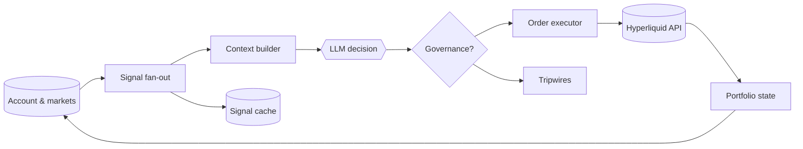
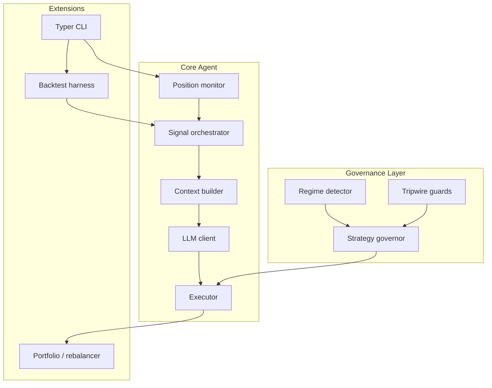

# Hyperliquid Trading Agent

LLM-steered trading loops for Hyperliquid spot and perp markets, designed for small teams that value clear safety rails over black boxes.

**Quick Links**
- [Getting Started](docs/guide/getting-started.md)
- [Configuration Guide](docs/guide/configuration.md)
- [Architecture Notes](docs/architecture/overview.md)
- [`config.toml.example`](config.toml.example)
- [Strategy Cookbook](docs/strategies)

## What You Get
- Continuous monitor → decide → execute loop with optional governance across fast/medium/slow cadences
- Signal fan-out that mixes Hyperliquid telemetry, on-chain data, and external sentiment before reaching the LLM
- Markdown-defined strategies and prompt templates that non-engineers can edit safely
- Tripwires, regime detection, and stateful scorekeeping to keep overconfident models in check
- Backtesting CLI plus structured logs/metrics for the boring but necessary validation work
- LangGraph orchestrator with snapshot exports, interrupt approvals, and Prometheus-friendly metrics out of the box

## How The Loop Works


## Architecture Snapshot


## Setup
### Prerequisites
- Python 3.11+
- [uv](https://docs.astral.sh/uv/) package manager
- Hyperliquid API keypair + wallet secret
- LLM credentials (OpenAI or Anthropic); optional secondary provider for regime detection

### Install
```bash
uv pip install -e .  # or uv pip install .
```

### Configure
1. Copy `config.toml.example` → `config.toml`.
2. Fill in `[hyperliquid]`, `[llm]`, `[agent]`, and optionally `[governance]` + `[backtesting]`.
3. Keep credentials local—`config.toml` is intentionally gitignored.

## Configuration Cheatsheet
- `[hyperliquid]`: RPC endpoints, API keys, wallet secret, tick rate, market filters.
- `[llm]`: provider, model, temperature, max tokens, JSON schema toggle.
- `[agent]`: loop cadence, prompt paths, log level, retry/backoff behavior.
- `[governance]`: regime detector cadence, governor advantage thresholds, tripwire budget.
- `[backtesting]`: data sources, slippage assumptions, output paths (`backtest_results/`).

## Running It
```bash
# Standard agent
uv run degen start --config config.toml

# Governed multi-timescale mode (LangGraph runtime, default)
uv run degen start --config config.toml --governed

# Opt out of LangGraph and fall back to the legacy orchestrator
uv run degen start --config config.toml --governed --legacy-orchestrator --async

# Inspect checkpoints or pending interrupts
uv run degen graph snapshot list
uv run degen graph interrupt resolve <interrupt-id> --decision approve

# Inspect current positions without touching strategies
uv run degen status --config config.toml

# Run a recorded-market backtest (results land in backtest_results/)
uv run degen backtest --config config.toml --strategy momentum
```

CLI entry points live in `src/hyperliquid_agent/cli.py`. The script name is `degen` (exported via `pyproject.toml`).

## Strategies & Prompts
- Strategies live in `strategies/*.md`. Each file uses YAML front matter: `name`, `markets`, `risk_budget`, `status`, optional knobs like `tripwire_overrides`.
- The body text becomes part of the LLM context, so keep it short and concrete.
- Prompts are in `prompts/` (e.g., `prompts/default.txt`). Override per agent config to experiment with tone or schema.

## Operations & Safety Nets
- Logs stream to `logs/agent.log` plus stdout; set `[agent].log_level = "DEBUG"` for market resolution traces.
- Tripwires watch margin ratio, liquidation proximity, loss limits, API health, and signal freshness. Breaches will pause execution until conditions recover.
- Regime detector can swap strategies based on macro signals (cooldowns + hysteresis prevent thrash).
- Position snapshots persist under `state/` so restarts pick up governance history.
- Backtesting and diagnostic scripts (see `examples/` and `scripts/`) help prove out strategies before touching real balances.

## Troubleshooting Quick Hits
- **No trades?** Check `logs/agent.log` for LLM JSON errors and confirm the strategy front matter says `status: active`.
- **Market mismatch?** `uv run degen status` prints the resolved market name; verify it matches the Hyperliquid listing.
- **High API spend?** Increase `agent.tick_interval_seconds`, reduce LLM `max_tokens`, or switch to a cheaper provider for the decision loop.
- **Precision errors?** Look for `sz_decimals` in the logs—round sizes before they reach the executor.

## Resources & Next Steps
- Read `docs/guide/cli-reference.md` for every flag the Typer CLI exposes.
- Browse `docs/architecture/` when extending modules (signal orchestrator, market registry, governance, etc.).
- Use `tests/` and `pyproject.toml` to see the preferred tooling: `uv`, `pytest`, `pyrefly`, and `ruff`.
- Follow `docs/architecture/hitl.md` for the human-in-the-loop approval workflow and `degen graph` tooling.

## Disclaimer
This project ships without warranties. Hyperliquid trading is risky; start on testnet, size small, and proceed only with capital you can afford to lose.

## License
MIT
