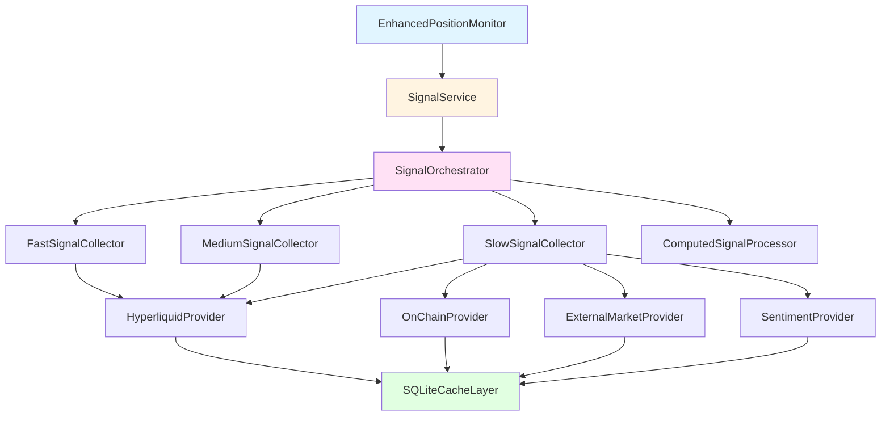

# Enhanced Monitoring

## Overview

The Enhanced Monitoring system provides time-scale-appropriate market signals for the governed trading agent. It extends the base `PositionMonitor` with multi-timescale signal collection organized into fast, medium, and slow loops, each optimized for different decision frequencies.

The system uses asynchronous signal collection with caching, concurrent data fetching, and graceful degradation to ensure reliable operation even under adverse network conditions.

## Architecture Diagram



## Key Concepts

### Time-Scale Loops

The monitoring system organizes signals into three time-scale loops:

- **Fast Loop** (seconds): Execution-level signals for immediate risk management
  - Order book spreads and depth
  - Slippage estimates
  - API latency
  - Micro PnL changes

- **Medium Loop** (minutes-hours): Tactical signals for strategy planning
  - Technical indicators (RSI, MACD, Bollinger Bands)
  - Funding rates and trends
  - Open interest changes
  - Volatility measures

- **Slow Loop** (daily-weekly): Macro signals for regime detection
  - Macro economic events
  - Cross-asset correlations
  - Sentiment indicators
  - Token unlocks and whale flows

### Signal Quality Metadata

Every signal collection includes quality metadata:

```python
@dataclass
class SignalQualityMetadata:
    timestamp: datetime          # When data was collected
    confidence: float            # 0.0 to 1.0 based on completeness
    staleness_seconds: float     # Age of data
    sources: list[str]           # Data providers used
    is_cached: bool              # Whether from cache
```

This enables downstream components to assess data reliability and make informed decisions about signal usage.

## Implementation Details

### EnhancedPositionMonitor

The `EnhancedPositionMonitor` extends the base `PositionMonitor` with signal collection capabilities:

```python
class EnhancedPositionMonitor(PositionMonitor):
    """Enhanced position monitor that collects time-scale-appropriate signals."""
    
    def __init__(self, *args, **kwargs):
        super().__init__(*args, **kwargs)
        
        # Initialize signal service with configuration
        signal_config = {
            "collection_timeout_seconds": 30.0,
            "cache_db_path": "state/signal_cache.db",
            "enable_caching": True,
        }
        
        self.signal_service = SignalService(config=signal_config)
        self.signal_service.start()  # Start background thread
```

**Key responsibilities:**

1. **Watchlist Building**: Identifies which assets need price data
2. **Price Fetching**: Retrieves current prices for watchlist assets
3. **Signal Collection**: Coordinates time-scale-appropriate signal gathering
4. **State Enhancement**: Combines base account state with collected signals

### Watchlist Building

The watchlist determines which assets require price data and signal collection:

```python
def build_watchlist(self, account_state, active_plan=None) -> list[str]:
    """Build watchlist of coins needing price data.
    
    Only includes tradeable perpetual contracts from:
    - Active perpetual positions (not spot balances)
    - Plan target allocations (perp market type only)
    - Major coins for regime detection (BTC, ETH)
    """
    watchlist = set()
    
    # Add perpetual positions
    for position in account_state.positions:
        if position.market_type == "perp":
            if position.coin in self.valid_perp_markets:
                watchlist.add(position.coin)
    
    # Add plan target allocations (perp only)
    if active_plan and hasattr(active_plan, "target_allocations"):
        for allocation in active_plan.target_allocations:
            if allocation.market_type == "perp":
                if allocation.coin in self.valid_perp_markets:
                    watchlist.add(allocation.coin)
    
    # Always include majors for regime detection
    for coin in ["BTC", "ETH"]:
        if coin in self.valid_perp_markets:
            watchlist.add(coin)
    
    return list(watchlist)
```

**Important:** Spot balances are explicitly excluded as they represent settlement capital, not tradeable instruments on the perpetual exchange.

### Signal Collection Flow

The `get_current_state_with_signals()` method orchestrates the complete signal collection process:

```python
def get_current_state_with_signals(
    self,
    loop_type: Literal["fast", "medium", "slow"],
    timeout_seconds: float = 30.0,
    active_plan=None,
) -> EnhancedAccountState:
    """Get account state with appropriate signals for loop type."""
    
    # 1. Get base account state
    base_state = self.get_current_state()
    
    # 2. Build watchlist and fetch prices
    watchlist = self.build_watchlist(base_state, active_plan)
    price_map = self.fetch_watchlist_prices(watchlist)
    
    # 3. Create enhanced state with price_map
    enhanced = EnhancedAccountState(
        portfolio_value=base_state.portfolio_value,
        available_balance=base_state.available_balance,
        positions=base_state.positions,
        spot_balances=base_state.spot_balances,
        timestamp=base_state.timestamp,
        is_stale=base_state.is_stale,
        price_map=price_map,
    )
    
    # 4. Collect signals based on loop type
    if loop_type in ["fast", "medium", "slow"]:
        signals = self.signal_service.collect_signals_sync(
            signal_type="fast",
            account_state=base_state,
            timeout_seconds=timeout_seconds,
        )
        enhanced.fast_signals = signals
    
    # ... similar for medium and slow signals
    
    return enhanced
```

### SignalService Bridge

The `SignalService` bridges synchronous governance code with asynchronous signal collection:

```python
class SignalService:
    """Bridge between sync governance and async signal collection."""
    
    def start(self):
        """Start background thread with async event loop."""
        self._thread = threading.Thread(target=self._run_event_loop, daemon=True)
        self._thread.start()
    
    def collect_signals_sync(
        self,
        signal_type: str,
        account_state: AccountState,
        timeout_seconds: float,
    ):
        """Collect signals synchronously by submitting to background loop."""
        future = asyncio.run_coroutine_threadsafe(
            self.orchestrator.collect_signals(request),
            self._loop
        )
        return future.result(timeout=timeout_seconds)
```

This design allows the synchronous governance system to leverage async I/O for efficient concurrent data fetching.

## Data Flow

### Fast Loop Signal Collection

Fast loop signals are collected at high frequency (seconds) for execution-level decisions and immediate risk management.

**Collection Frequency**: Every few seconds during active trading

**Signal Types**:

| Signal | Description | Use Case |
|--------|-------------|----------|
| `spreads` | Bid-ask spread in basis points per coin | Execution cost estimation |
| `slippage_estimates` | Expected slippage in basis points | Order sizing decisions |
| `short_term_volatility` | Recent volatility measure | Risk assessment |
| `micro_pnl` | Very short-term PnL change | Position monitoring |
| `partial_fill_rates` | Expected fill rate (0.0 to 1.0) | Order execution strategy |
| `order_book_depth` | Liquidity within 1% of mid-price | Market impact estimation |
| `api_latency_ms` | API response time in milliseconds | System health monitoring |

**Collection Process**:

1. **Identify Positions**: Filter for perpetual positions only
   ```python
   perp_positions = [p for p in account_state.positions if p.market_type == "perp"]
   ```

2. **Concurrent Fetching**: Spawn async tasks for each position's order book
   ```python
   tasks = [self.hyperliquid_provider.fetch_order_book(pos.coin) for pos in perp_positions]
   order_book_responses = await asyncio.gather(*tasks, return_exceptions=True)
   ```

3. **Process Results**: Calculate spreads, depth, slippage estimates
   ```python
   if ob_data.bids and ob_data.asks:
       best_bid = ob_data.bids[0][0]
       best_ask = ob_data.asks[0][0]
       mid_price = (best_bid + best_ask) / 2
       
       # Calculate spread in basis points
       spread_bps = calculate_spread_bps(best_bid, best_ask)
       spreads[coin] = spread_bps
       
       # Calculate order book depth within 1% of mid-price
       threshold = mid_price * 0.01
       bid_depth = sum(size for price, size in ob_data.bids if abs(price - mid_price) <= threshold)
       ask_depth = sum(size for price, size in ob_data.asks if abs(price - mid_price) <= threshold)
       total_depth = bid_depth + ask_depth
       order_book_depth[coin] = total_depth
       
       # Estimate slippage based on depth
       if total_depth > 100:
           slippage_estimates[coin] = spread_bps * 0.3  # High liquidity
       elif total_depth > 20:
           slippage_estimates[coin] = spread_bps * 0.5  # Medium liquidity
       else:
           slippage_estimates[coin] = spread_bps * 0.8  # Low liquidity
   ```

4. **Measure Latency**: Track API response times
   ```python
   api_start_time = time.time()
   # ... fetch data ...
   api_latency_ms = (time.time() - api_start_time) * 1000
   ```

5. **Build Metadata**: Create quality metadata with confidence scores
   ```python
   avg_confidence = total_confidence / successful_fetches if successful_fetches > 0 else 0.0
   metadata = SignalQualityMetadata(
       timestamp=datetime.now(),
       confidence=avg_confidence,
       staleness_seconds=0.0,
       sources=["hyperliquid"],
       is_cached=any(not isinstance(r, BaseException) and r.is_cached for r in order_book_responses),
   )
   ```

6. **Return Signals**: Package as `FastLoopSignals` with metadata
   ```python
   return FastLoopSignals(
       spreads=spreads,
       slippage_estimates=slippage_estimates,
       short_term_volatility=short_term_vol,
       micro_pnl=micro_pnl,
       partial_fill_rates=partial_fill_rates,
       order_book_depth=order_book_depth,
       api_latency_ms=api_latency_ms,
       metadata=metadata,
   )
   ```

**Performance Characteristics**:

- **Latency**: ~200-500ms for 5-10 positions (concurrent fetching)
- **Cache TTL**: 5-10 seconds (order books change rapidly)
- **Timeout**: 5 seconds (execution-critical)
- **Fallback**: Conservative estimates on failure (wider spreads, higher slippage)

### Medium Loop Signal Collection

Medium loop signals are collected at moderate frequency (minutes to hours) for tactical planning and strategy plan card maintenance.

**Collection Frequency**: Every 5-15 minutes during active trading

**Signal Types**:

| Signal | Description | Use Case |
|--------|-------------|----------|
| `realized_vol_1h` | 1-hour realized volatility | Short-term risk assessment |
| `realized_vol_24h` | 24-hour realized volatility | Daily risk budgeting |
| `trend_score` | Trend strength indicator (-1 to 1) | Trend-following strategies |
| `funding_basis` | Funding rate per coin (%) | Funding arbitrage opportunities |
| `perp_spot_basis` | Perp-spot basis in bps | Basis trading strategies |
| `concentration_ratios` | Position concentration (0.0 to 1.0) | Portfolio diversification |
| `drift_from_targets` | Drift from target allocation (%) | Rebalancing triggers |
| `technical_indicators` | RSI, MACD, Bollinger Bands | Technical analysis |
| `open_interest_change_24h` | 24h OI change percentage | Leverage trend detection |
| `oi_to_volume_ratio` | OI-to-volume ratio | Market leverage assessment |
| `funding_rate_trend` | Funding trend (increasing/decreasing/stable) | Funding momentum |

**Technical Indicators Available**:

```python
@dataclass
class TechnicalIndicators:
    rsi: float                    # Relative Strength Index (0-100)
    macd: float                   # MACD line value
    macd_signal: float            # MACD signal line
    macd_histogram: float         # MACD histogram
    bb_upper: float               # Bollinger Band upper
    bb_middle: float              # Bollinger Band middle (SMA)
    bb_lower: float               # Bollinger Band lower
    bb_position: float            # Price position in BB (0.0 to 1.0)
    sma_20: float                 # 20-period Simple Moving Average
    sma_50: float                 # 50-period Simple Moving Average
    ema_12: float                 # 12-period Exponential Moving Average
    ema_26: float                 # 26-period Exponential Moving Average
```

**Collection Process**:

1. **Identify Positions**: Filter for perpetual positions
   ```python
   perp_positions = [p for p in account_state.positions if p.market_type == "perp"]
   ```

2. **Concurrent Fetching**: Spawn tasks for funding history, OI data, candles
   ```python
   funding_tasks = []
   oi_tasks = []
   candles_tasks = []
   
   for position in perp_positions:
       coin = position.coin
       
       # Funding rate history (last 24 hours)
       start_time, end_time = self._get_timestamp_range(hours_back=24)
       funding_tasks.append(
           self.hyperliquid_provider.fetch_funding_history(coin, start_time, end_time)
       )
       
       # Open interest data
       oi_tasks.append(self.hyperliquid_provider.fetch_open_interest(coin))
       
       # Candles for technical indicators (last 7 days of 1h candles)
       start_time_candles, end_time_candles = self._get_timestamp_range(hours_back=168)
       candles_tasks.append(
           self.hyperliquid_provider.fetch_candles(coin, "1h", start_time_candles, end_time_candles)
       )
   
   # Execute all tasks concurrently
   funding_responses = await asyncio.gather(*funding_tasks, return_exceptions=True)
   oi_responses = await asyncio.gather(*oi_tasks, return_exceptions=True)
   candles_responses = await asyncio.gather(*candles_tasks, return_exceptions=True)
   ```

3. **Update History**: Maintain rolling buffers for price and OI history
   ```python
   # Price history: 90 days of 4-hour candles
   if coin not in self.price_history:
       self.price_history[coin] = PriceHistory()
   
   history = self.price_history[coin]
   for candle in candles:
       history.add_candle(
           close=candle.close,
           high=candle.high,
           low=candle.low,
           timestamp=candle.timestamp,
       )
   
   # OI history: 24 hours of data points
   if coin not in self.oi_history:
       self.oi_history[coin] = OpenInterestHistory()
   
   self.oi_history[coin].add_value(oi_data.open_interest, oi_data.timestamp)
   ```

4. **Calculate Indicators**: Compute RSI, MACD, Bollinger Bands from candles
   ```python
   if len(candles) >= 50:
       indicators = await self.computed_processor.calculate_technical_indicators(candles)
       technical_indicators[coin] = indicators
   ```

5. **Analyze Trends**: Detect funding rate trends, OI changes
   ```python
   # Funding rate trend
   rates = [fr.rate for fr in funding_rates]
   funding_rate_trend[coin] = self._calculate_funding_trend(rates)
   
   # 24h OI change from historical data
   oi_change = self.oi_history[coin].calculate_24h_change()
   open_interest_change_24h[coin] = oi_change
   
   # OI-to-volume ratio
   volume_24h = sum(c.volume for c in candles[-24:])
   if volume_24h > 0:
       oi_to_volume_ratio[coin] = oi_data.open_interest / volume_24h
   ```

6. **Build Metadata**: Track data sources and confidence
   ```python
   avg_confidence = total_confidence / successful_fetches if successful_fetches > 0 else 0.0
   metadata = SignalQualityMetadata(
       timestamp=datetime.now(),
       confidence=avg_confidence,
       staleness_seconds=0.0,
       sources=["hyperliquid"],
       is_cached=any(not isinstance(r, BaseException) and r.is_cached for responses in [funding_responses, oi_responses, candles_responses] for r in responses),
   )
   ```

7. **Return Signals**: Package as `MediumLoopSignals` with metadata

**Funding Rate Trend Detection**:

The system analyzes funding rate history to detect momentum:

```python
def _calculate_funding_trend(rates: list[float]) -> Literal["increasing", "decreasing", "stable"]:
    """Calculate funding rate trend from historical rates."""
    if len(rates) < 3:
        return "stable"
    
    # Split into first half and second half
    mid = len(rates) // 2
    first_half_avg = sum(rates[:mid]) / mid
    second_half_avg = sum(rates[mid:]) / (len(rates) - mid)
    
    # Calculate percentage change
    pct_change = (second_half_avg - first_half_avg) / abs(first_half_avg)
    
    # Classify trend (10% threshold)
    if pct_change > 0.1:
        return "increasing"
    elif pct_change < -0.1:
        return "decreasing"
    else:
        return "stable"
```

**Performance Characteristics**:

- **Latency**: ~1-3 seconds for 5-10 positions (concurrent fetching)
- **Cache TTL**: 5-10 minutes (tactical data changes moderately)
- **Timeout**: 15 seconds (tactical planning)
- **Fallback**: Zero values or None for missing indicators

**Historical Data Management**:

The system maintains rolling buffers for multi-timeframe analysis:

```python
class PriceHistory:
    """Maintains 90 days of 4-hour candles (540 data points)."""
    
    def calculate_returns(self) -> dict[str, float] | None:
        """Calculate multi-timeframe returns."""
        returns = {}
        
        # 1-day return (6 candles ago)
        if len(self.closes) >= 7:
            price_1d_ago = self.closes[-7]
            returns["return_1d"] = ((current_price - price_1d_ago) / price_1d_ago) * 100
        
        # 7-day return (42 candles ago)
        if len(self.closes) >= 43:
            price_7d_ago = self.closes[-43]
            returns["return_7d"] = ((current_price - price_7d_ago) / price_7d_ago) * 100
        
        # 30-day return (180 candles ago)
        if len(self.closes) >= 181:
            price_30d_ago = self.closes[-181]
            returns["return_30d"] = ((current_price - price_30d_ago) / price_30d_ago) * 100
        
        # 90-day return (540 candles ago)
        if len(self.closes) >= 541:
            price_90d_ago = self.closes[-541]
            returns["return_90d"] = ((current_price - price_90d_ago) / price_90d_ago) * 100
        
        return returns
```

### Slow Loop Signal Collection

Slow loop signals are collected at low frequency (daily to weekly) for regime detection and macro-level policy changes.

**Collection Frequency**: Every 1-24 hours depending on signal type

**Signal Types**:

| Signal | Description | Use Case |
|--------|-------------|----------|
| `macro_events_upcoming` | List of upcoming macro events | Event-driven trading |
| `cross_asset_risk_on_score` | Risk-on/risk-off score (-1 to 1) | Regime classification |
| `venue_health_score` | Exchange health indicator (0 to 1) | System reliability |
| `liquidity_regime` | Overall liquidity (high/medium/low) | Strategy selection |
| `btc_eth_correlation` | BTC-ETH correlation (-1 to 1) | Diversification analysis |
| `btc_spx_correlation` | BTC-SPX correlation (optional) | Macro correlation |
| `fear_greed_index` | Sentiment score (-1 to 1) | Contrarian signals |
| `token_unlocks_7d` | Upcoming token unlocks | Supply shock risk |
| `whale_flow_24h` | Net whale flow per asset | Smart money tracking |

**Macro Event Types**:

```python
@dataclass
class MacroEvent:
    name: str                                    # Event name (e.g., 'FOMC Meeting')
    datetime: datetime                           # When event occurs (UTC)
    impact: Literal["high", "medium", "low"]     # Expected market impact
    category: str                                # Event category (e.g., 'FOMC', 'CPI', 'NFP')
```

**Common macro event categories**:
- **FOMC**: Federal Open Market Committee meetings
- **CPI**: Consumer Price Index releases
- **NFP**: Non-Farm Payrolls reports
- **GDP**: Gross Domestic Product releases
- **PCE**: Personal Consumption Expenditures
- **Retail Sales**: Consumer spending data
- **Unemployment**: Jobless claims and unemployment rate

**Token Unlock Events**:

```python
@dataclass
class UnlockEvent:
    asset: str                      # Asset symbol (e.g., 'BTC', 'ETH')
    unlock_date: datetime           # When tokens will be unlocked
    amount: float                   # Number of tokens being unlocked
    percentage_of_supply: float     # Percentage of total supply
```

Token unlocks can create supply shocks and price pressure. The system tracks unlocks within the next 7 days for portfolio assets.

**Whale Flow Data**:

```python
@dataclass
class WhaleFlowData:
    asset: str                      # Asset symbol
    inflow: float                   # Total inflow from large transactions (24h)
    outflow: float                  # Total outflow from large transactions (24h)
    net_flow: float                 # Net flow (inflow - outflow)
    large_tx_count: int             # Number of large transactions detected
```

Whale flows track large wallet movements to identify potential market impact from smart money.

**Collection Process**:

1. **Concurrent Fetching**: Spawn tasks for all slow signal sources
   ```python
   # Create concurrent tasks for all slow signals
   macro_events_task = self._fetch_macro_events()
   btc_eth_corr_task = self._fetch_btc_eth_correlation()
   btc_spx_corr_task = self._fetch_btc_spx_correlation()
   fear_greed_task = self._fetch_fear_greed_index()
   token_unlocks_task = self._fetch_token_unlocks(account_state.positions)
   whale_flows_task = self._fetch_whale_flows(account_state.positions)
   venue_health_task = self._assess_venue_health_async()
   liquidity_regime_task = self._assess_liquidity_regime_async(account_state.positions)
   
   # Execute all tasks concurrently
   results = await asyncio.gather(
       macro_events_task,
       btc_eth_corr_task,
       btc_spx_corr_task,
       fear_greed_task,
       token_unlocks_task,
       whale_flows_task,
       venue_health_task,
       liquidity_regime_task,
       return_exceptions=True,
   )
   ```

2. **Aggregate Results**: Handle partial success with fallback values
   ```python
   # Unpack results with proper type handling
   macro_events = results[0] if not isinstance(results[0], BaseException) else []
   btc_eth_corr = results[1] if not isinstance(results[1], BaseException) else 0.0
   btc_spx_corr = results[2] if not isinstance(results[2], BaseException) else None
   fear_greed = results[3] if not isinstance(results[3], BaseException) else 0.0
   token_unlocks = results[4] if not isinstance(results[4], BaseException) else []
   whale_flows = results[5] if not isinstance(results[5], BaseException) else {}
   venue_health = results[6] if not isinstance(results[6], BaseException) else 0.5
   liquidity_regime = results[7] if not isinstance(results[7], BaseException) else "medium"
   ```

3. **Calculate Risk Score**: Derive cross-asset risk-on score from BTC funding
   ```python
   async def _calculate_risk_on_score(self) -> float:
       """Calculate cross-asset risk-on score using BTC funding as proxy."""
       start_time, end_time = self._get_timestamp_range(hours_back=168)  # 7 days
       funding_response = await self.hyperliquid_provider.fetch_funding_history(
           "BTC", start_time, end_time
       )
       
       funding_rates = funding_response.data
       if funding_rates:
           rates = [fr.rate for fr in funding_rates]
           avg_funding = sum(rates) / len(rates)
           
           # Positive funding = longs paying shorts = risk-on
           # Normalize to -1 to +1 scale (typical funding is -0.01% to +0.01%)
           return max(-1.0, min(1.0, avg_funding * 10000))
       
       return 0.0
   ```

4. **Assess Venue Health**: Monitor API response times and status
   ```python
   async def _assess_venue_health_async(self) -> float:
       """Assess venue health based on API response times."""
       start_time = time.time()
       meta = self.info.meta()
       response_time_ms = (time.time() - start_time) * 1000
       
       # Calculate health score based on response time
       if response_time_ms < 1000:
           health_score = 1.0      # Excellent
       elif response_time_ms < 2000:
           health_score = 0.8      # Good
       elif response_time_ms < 5000:
           health_score = 0.5      # Degraded
       else:
           health_score = 0.3      # Poor
       
       # Validate API response
       if not meta or "universe" not in meta:
           health_score *= 0.5
       
       return health_score
   ```

5. **Assess Liquidity Regime**: Classify based on order book depth
   ```python
   async def _assess_liquidity_regime_async(self, positions: list[Position]) -> Literal["high", "medium", "low"]:
       """Assess liquidity regime from order book depth."""
       # Sample liquidity from largest position
       largest_position = max(positions, key=lambda p: abs(p.size * p.current_price))
       
       ob_response = await self.hyperliquid_provider.fetch_order_book(largest_position.coin)
       ob_data = ob_response.data
       
       if ob_data.bids and ob_data.asks:
           best_bid = ob_data.bids[0][0]
           best_ask = ob_data.asks[0][0]
           mid_price = (best_bid + best_ask) / 2
           threshold = mid_price * 0.01
           
           # Calculate total depth within 1% of mid
           bid_depth = sum(size for price, size in ob_data.bids if abs(price - mid_price) <= threshold)
           ask_depth = sum(size for price, size in ob_data.asks if abs(price - mid_price) <= threshold)
           total_depth = bid_depth + ask_depth
           
           # Classify liquidity
           if total_depth > 100:
               return "high"
           elif total_depth > 20:
               return "medium"
           else:
               return "low"
       
       return "medium"
   ```

6. **Build Metadata**: Track all data sources and confidence
   ```python
   sources = ["hyperliquid"]
   
   if not isinstance(results[0], BaseException):
       sources.append("external_market")
   if not isinstance(results[3], BaseException):
       sources.append("sentiment")
   if not isinstance(results[4], BaseException) or not isinstance(results[5], BaseException):
       sources.append("onchain")
   
   avg_confidence = total_confidence / successful_fetches if successful_fetches > 0 else 0.5
   metadata = SignalQualityMetadata(
       timestamp=datetime.now(),
       confidence=avg_confidence,
       staleness_seconds=0.0,
       sources=list(set(sources)),
       is_cached=False,
   )
   ```

7. **Return Signals**: Package as `SlowLoopSignals` with metadata

**Performance Characteristics**:

- **Latency**: ~5-10 seconds for all slow signals (concurrent fetching)
- **Cache TTL**: 30 minutes to 1 hour (macro data changes slowly)
- **Timeout**: 30 seconds (macro analysis)
- **Fallback**: Neutral values (0.0, "medium", empty lists)

**Data Sources**:

| Signal | Primary Source | Fallback |
|--------|---------------|----------|
| Macro events | External market provider | Empty list |
| BTC-ETH correlation | External market provider | 0.0 |
| BTC-SPX correlation | External market provider | None |
| Fear & greed | Sentiment provider | 0.0 |
| Token unlocks | On-chain provider | Empty list |
| Whale flows | On-chain provider | Empty dict |
| Venue health | Hyperliquid API | 0.5 |
| Liquidity regime | Hyperliquid order books | "medium" |

## Configuration

### Signal Service Configuration

```python
signal_config = {
    # Global timeout for signal collection
    "collection_timeout_seconds": 30.0,
    
    # SQLite cache database path
    "cache_db_path": "state/signal_cache.db",
    
    # Enable/disable caching
    "enable_caching": True,
    
    # Per-signal-type timeouts (optional overrides)
    "fast_timeout_seconds": 5.0,
    "medium_timeout_seconds": 15.0,
    "slow_timeout_seconds": 30.0,
}
```

### Cache TTL Configuration

Cache time-to-live values are configured per data type in the providers:

```python
# Fast signals - very short TTL
order_book_ttl = 5      # 5 seconds
mid_price_ttl = 10      # 10 seconds

# Medium signals - moderate TTL
candles_ttl = 300       # 5 minutes
funding_ttl = 600       # 10 minutes
oi_ttl = 600            # 10 minutes

# Slow signals - longer TTL
macro_events_ttl = 3600     # 1 hour
correlation_ttl = 3600      # 1 hour
sentiment_ttl = 1800        # 30 minutes
```

## Caching Strategies

The monitoring system uses a SQLite-based caching layer for persistence, simplicity, and zero-config deployment. This is perfect for startup-scale operations without Redis overhead.

### SQLite Cache Architecture

```python
class SQLiteCacheLayer:
    """SQLite-based caching layer with TTL and invalidation support."""
    
    def __init__(self, db_path: Path | str = "state/signal_cache.db"):
        self.db_path = Path(db_path)
        self.db_path.parent.mkdir(parents=True, exist_ok=True)
        self._init_db()
        self.vacuum()  # Optimize database on startup
```

**Database Schema**:

```sql
CREATE TABLE cache (
    key TEXT PRIMARY KEY,
    value BLOB,                 -- Pickled Python object
    expires_at REAL,            -- Unix timestamp
    created_at REAL,            -- Unix timestamp
    hit_count INTEGER DEFAULT 0 -- Track cache hits
);

CREATE INDEX idx_expires ON cache(expires_at);
```

### Cache Operations

**Get Operation**:

```python
async def get(self, key: str) -> CacheEntry | None:
    """Retrieve cached value if not expired."""
    self._total_requests += 1
    
    cursor = conn.execute(
        "SELECT value, expires_at, created_at FROM cache WHERE key = ? AND expires_at > ?",
        (key, datetime.now().timestamp()),
    )
    row = cursor.fetchone()
    
    if row:
        # Update hit count
        conn.execute("UPDATE cache SET hit_count = hit_count + 1 WHERE key = ?", (key,))
        
        self._total_hits += 1
        value = pickle.loads(row[0])
        age = datetime.now().timestamp() - row[2]
        return CacheEntry(value=value, age_seconds=age)
    
    return None
```

**Set Operation**:

```python
async def set(self, key: str, value: Any, ttl_seconds: int):
    """Store value with TTL."""
    expires_at = (datetime.now() + timedelta(seconds=ttl_seconds)).timestamp()
    created_at = datetime.now().timestamp()
    
    conn.execute(
        "INSERT OR REPLACE INTO cache (key, value, expires_at, created_at) VALUES (?, ?, ?, ?)",
        (key, pickle.dumps(value), expires_at, created_at),
    )
```

**Invalidation Operations**:

```python
# Invalidate by pattern (SQL LIKE syntax)
await cache.invalidate("orderbook:%")  # All order book entries

# Invalidate by exact key
await cache.invalidate_by_key("orderbook:BTC")

# Invalidate all entries (forced refresh)
await cache.invalidate_all()
```

### Cache Key Patterns

The system uses structured cache keys for efficient invalidation:

```python
# Order book data
key = f"orderbook:{coin}"

# Mid-price data
key = f"mid_price:{coin}"

# Candles data
key = f"candles:{coin}:{interval}:{start_time}:{end_time}"

# Funding history
key = f"funding:{coin}:{start_time}:{end_time}"

# Open interest
key = f"oi:{coin}"

# Technical indicators
key = f"indicators:{coin}:{interval}:{lookback}"

# Macro events
key = f"macro_events:{days_ahead}"

# Correlations
key = f"correlation:{asset1}:{asset2}:{days_back}"
```

### TTL Strategy by Signal Type

**Fast Signals** (5-10 seconds):
- Order books change rapidly
- Short TTL prevents stale execution data
- Cache primarily for burst protection

**Medium Signals** (5-10 minutes):
- Technical indicators change moderately
- Longer TTL reduces API load
- Cache enables tactical planning without constant fetching

**Slow Signals** (30 minutes - 1 hour):
- Macro data changes slowly
- Long TTL significantly reduces external API calls
- Cache enables offline operation for extended periods

### Cache Metrics and Monitoring

```python
@dataclass
class CacheMetrics:
    total_entries: int          # Valid entries in cache
    total_hits: int             # Total cache hits
    avg_hits_per_entry: float   # Average hits per entry
    hit_rate: float             # Percentage of cache hits
    total_misses: int           # Total cache misses
    avg_age_seconds: float      # Average age of entries
    expired_entries: int        # Expired entries pending cleanup
```

**Accessing Cache Metrics**:

```python
# Get cache metrics from monitor
metrics = monitor.get_cache_metrics()

if metrics["status"] == "success":
    cache_stats = metrics["cache"]
    print(f"Cache entries: {cache_stats['total_entries']}")
    print(f"Hit rate: {cache_stats['hit_rate_percent']:.1f}%")
    print(f"Avg age: {cache_stats['avg_age_seconds']:.1f}s")
    print(f"Expired entries: {cache_stats['expired_entries']}")
```

**Interpreting Metrics**:

- **Hit rate > 70%**: Excellent caching performance
- **Hit rate 40-70%**: Good caching performance
- **Hit rate < 40%**: Consider increasing TTL values or investigating cache invalidation patterns
- **Avg age > 50% of TTL**: Cache is being used effectively
- **Expired entries > 100**: Run cleanup more frequently

### Periodic Cleanup

The cache layer supports automatic cleanup of expired entries:

```python
async def start_periodic_cleanup(self, interval_seconds: int = 300):
    """Start periodic cache cleanup task (default: 5 minutes)."""
    while True:
        for _ in range(interval_seconds):
            await asyncio.sleep(1)  # Responsive cancellation
        await self.cleanup_expired()
```

**Manual Cleanup**:

```python
# Clean up expired entries
await cache.cleanup_expired()

# Optimize database (reclaim space)
cache.vacuum()
```

### Cache Optimization Tips

**1. Tune TTL Values**:

```python
# Increase TTL for stable data
candles_ttl = 600  # 10 minutes instead of 5

# Decrease TTL for volatile data
order_book_ttl = 3  # 3 seconds instead of 5
```

**2. Monitor Hit Rates**:

```python
# Reset metrics to get fresh measurements
cache.reset_metrics()

# ... run for some time ...

# Check hit rates
metrics = cache.get_metrics()
if metrics.hit_rate < 0.4:
    logger.warning(f"Low cache hit rate: {metrics.hit_rate:.2%}")
```

**3. Invalidate Strategically**:

```python
# Invalidate only affected data after configuration change
await cache.invalidate("candles:%")  # Only candles

# Don't invalidate everything unless necessary
# await cache.invalidate_all()  # Avoid this
```

**4. Use Appropriate Cache Keys**:

```python
# Good: Specific cache key
key = f"orderbook:{coin}:{timestamp_bucket}"

# Bad: Too generic (causes unnecessary invalidation)
key = f"orderbook"
```

**5. Batch Invalidations**:

```python
# Invalidate multiple related entries at once
await cache.invalidate("orderbook:%")
await cache.invalidate("mid_price:%")
```

### Cache Failure Handling

The system gracefully handles cache failures:

```python
async def get(self, key: str) -> CacheEntry | None:
    try:
        # ... cache lookup ...
    except Exception as e:
        logger.error(f"Cache get error for key {key}: {e}")
        return None  # Fallback to fresh fetch
```

**Fallback Strategy**:

1. **Cache miss**: Fetch fresh data from provider
2. **Cache error**: Log error, fetch fresh data
3. **Provider error**: Use stale cached data if available
4. **Both fail**: Return fallback signals with low confidence

### Database Maintenance

**Vacuum Operation**:

```python
# Run on startup
cache.vacuum()

# Or periodically (e.g., daily)
schedule.every().day.at("03:00").do(cache.vacuum)
```

**Benefits**:
- Reclaims disk space from deleted entries
- Optimizes query performance
- Defragments database file

**Backup Strategy**:

```bash
# Backup cache database
cp state/signal_cache.db state/signal_cache.db.backup

# Restore from backup
cp state/signal_cache.db.backup state/signal_cache.db
```

### Performance Benchmarks

**Cache Performance** (SQLite on SSD):

- **Get operation**: ~0.1-0.5ms
- **Set operation**: ~0.5-2ms
- **Cleanup operation**: ~10-50ms (depends on expired count)
- **Vacuum operation**: ~100-500ms (depends on database size)

**Memory Usage**:

- **Cache overhead**: ~1-5MB for 1000 entries
- **Database file**: ~10-50MB for typical usage
- **Peak memory**: ~50-100MB during vacuum

**Comparison to Redis**:

| Metric | SQLite Cache | Redis |
|--------|-------------|-------|
| Setup complexity | Zero-config | Requires Redis server |
| Persistence | Built-in | Requires configuration |
| Memory usage | Low (disk-based) | High (memory-based) |
| Latency | 0.1-2ms | 0.05-1ms |
| Deployment | Single file | Separate service |
| Suitable for | Startup-scale | Enterprise-scale |

## Examples

### Basic Usage

```python
# Initialize enhanced monitor
monitor = EnhancedPositionMonitor(config, registry)

# Get state with fast signals for execution decisions
state = monitor.get_current_state_with_signals(
    loop_type="fast",
    timeout_seconds=5.0
)

# Access fast signals
if state.fast_signals:
    for coin, spread in state.fast_signals.spreads.items():
        print(f"{coin} spread: {spread:.2f} bps")
    
    print(f"API latency: {state.fast_signals.api_latency_ms:.1f}ms")
    print(f"Signal confidence: {state.fast_signals.metadata.confidence:.2f}")
```

### Medium Loop with Technical Indicators

```python
# Get state with medium signals for tactical planning
state = monitor.get_current_state_with_signals(
    loop_type="medium",
    timeout_seconds=15.0,
    active_plan=current_plan
)

# Access technical indicators
if state.medium_signals:
    for coin, indicators in state.medium_signals.technical_indicators.items():
        if indicators:
            print(f"{coin} RSI: {indicators.rsi:.2f}")
            print(f"{coin} MACD: {indicators.macd:.4f}")
            print(f"{coin} BB position: {indicators.bb_position:.2f}")
    
    # Check funding rate trends
    for coin, trend in state.medium_signals.funding_rate_trend.items():
        print(f"{coin} funding trend: {trend}")
```

### Slow Loop with Macro Signals

```python
# Get state with slow signals for regime detection
state = monitor.get_current_state_with_signals(
    loop_type="slow",
    timeout_seconds=30.0
)

# Access macro signals
if state.slow_signals:
    print(f"Risk-on score: {state.slow_signals.cross_asset_risk_on_score:.2f}")
    print(f"Venue health: {state.slow_signals.venue_health_score:.2f}")
    print(f"Liquidity regime: {state.slow_signals.liquidity_regime}")
    
    # Check upcoming macro events
    for event in state.slow_signals.macro_events_upcoming:
        print(f"Event: {event.name} at {event.datetime} (impact: {event.impact})")
    
    # Check token unlocks
    for unlock in state.slow_signals.token_unlocks_7d:
        print(f"Unlock: {unlock.asset} - {unlock.amount} tokens ({unlock.percentage_of_supply:.2f}%)")
```

### Cache Metrics Monitoring

```python
# Get cache performance metrics
metrics = monitor.get_cache_metrics()

if metrics["status"] == "success":
    cache_stats = metrics["cache"]
    print(f"Cache entries: {cache_stats['total_entries']}")
    print(f"Hit rate: {cache_stats['hit_rate_percent']:.1f}%")
    print(f"Avg age: {cache_stats['avg_age_seconds']:.1f}s")
    print(f"Expired entries: {cache_stats['expired_entries']}")
```

## Performance Considerations

### Concurrent Data Fetching

The monitoring system uses `asyncio.gather()` for concurrent data fetching:

```python
# Spawn concurrent tasks for all positions
tasks = [
    self.hyperliquid_provider.fetch_order_book(pos.coin)
    for pos in perp_positions
]

# Execute concurrently
results = await asyncio.gather(*tasks, return_exceptions=True)
```

This dramatically reduces latency compared to sequential fetching:
- Sequential: 10 positions × 200ms = 2000ms
- Concurrent: max(200ms) ≈ 200ms

### Caching Strategy

The SQLite cache layer provides:

1. **TTL-based expiration**: Automatic invalidation of stale data
2. **Hit rate tracking**: Monitor cache effectiveness
3. **Partial success handling**: Use cached data when fresh fetch fails
4. **Zero-config deployment**: No Redis or external dependencies

### Timeout Handling

Each signal type has appropriate timeout values:

- **Fast signals**: 5s timeout (execution-critical)
- **Medium signals**: 15s timeout (tactical planning)
- **Slow signals**: 30s timeout (macro analysis)

On timeout, the system returns fallback signals with low confidence scores, allowing governance to make informed decisions about data reliability.

### Memory Management

Historical data buffers use `collections.deque` with fixed maximum lengths:

```python
# Price history: 90 days of 4-hour candles
self.closes: deque[float] = deque(maxlen=540)

# OI history: 24 hours of 4-hour candles
self.values: deque[float] = deque(maxlen=7)
```

This prevents unbounded memory growth while maintaining sufficient history for analysis.

## Troubleshooting

### Signal Collection Timeouts

**Symptom**: Frequent timeout errors in logs

**Causes**:
- Network latency to Hyperliquid API
- Too many concurrent positions
- Insufficient timeout values

**Solutions**:
1. Increase timeout values in configuration
2. Reduce number of positions being monitored
3. Check network connectivity
4. Review cache hit rates (low hit rate = more API calls)

### Low Cache Hit Rates

**Symptom**: Cache hit rate below 50%

**Causes**:
- TTL values too short
- High data volatility
- Frequent cache invalidation

**Solutions**:
1. Increase TTL values for less volatile data
2. Review cache metrics to identify problematic data types
3. Consider adjusting collection frequency

### Stale Signal Data

**Symptom**: High `staleness_seconds` in metadata

**Causes**:
- API failures forcing cached data usage
- Network issues
- Provider downtime

**Solutions**:
1. Check `metadata.confidence` scores
2. Implement fallback logic for low-confidence signals
3. Monitor venue health scores
4. Consider reducing reliance on external providers

### High API Latency

**Symptom**: `api_latency_ms` consistently above 1000ms

**Causes**:
- Network congestion
- Hyperliquid API rate limiting
- Too many concurrent requests

**Solutions**:
1. Reduce concurrent request count
2. Implement request throttling
3. Increase cache TTL to reduce API calls
4. Check venue health scores

### Memory Growth

**Symptom**: Increasing memory usage over time

**Causes**:
- Historical buffers not properly bounded
- Cache database growth
- Unclosed connections

**Solutions**:
1. Verify `deque` maxlen values are set
2. Run periodic cache cleanup: `await cache.cleanup_expired()`
3. Run database vacuum: `cache.vacuum()`
4. Ensure proper shutdown: `monitor.shutdown()`

## Related Documentation

- [Signals Architecture](/architecture/signals) - Signal provider details
- [Governance System](/architecture/governance) - How signals inform governance decisions
- [Performance Tuning](/architecture/performance) - Cache optimization strategies
- [Configuration Reference](/guide/configuration) - Complete configuration options
