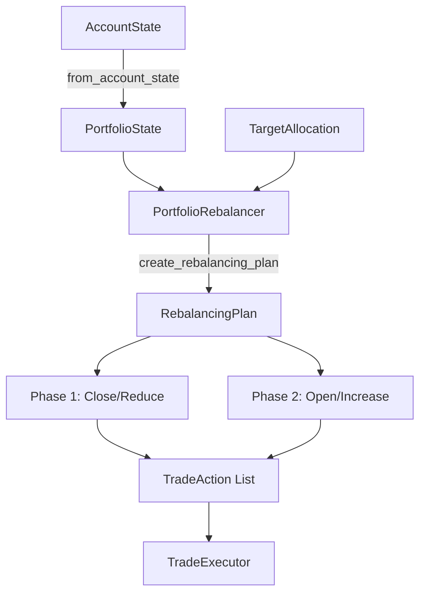
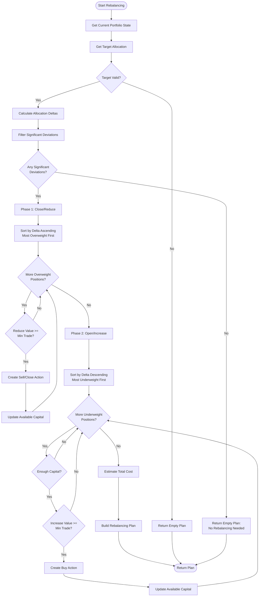

# Portfolio Management

## Overview

The Portfolio Management system handles rebalancing operations to maintain target asset allocations across the trading portfolio. It implements a two-phase rebalancing algorithm that respects capital constraints, minimum trade sizes, and slippage thresholds.

The system converts raw account state into allocation percentages, calculates deltas between current and target allocations, and generates an ordered sequence of trades to achieve the desired portfolio composition.

## Architecture Diagram



## Key Concepts

### PortfolioState
Current portfolio snapshot with allocation percentages for each asset. Includes total portfolio value, available balance, position details, and timestamp.

### TargetAllocation
Desired portfolio composition expressed as percentages (0.0 to 1.0) for each asset. Must sum to approximately 1.0 to be valid.

### RebalancingPlan
Ordered sequence of trade actions to move from current to target allocation, including estimated costs and reasoning.

### Two-Phase Rebalancing
1. **Phase 1 (Close/Reduce)**: Sell overweight positions to generate capital
2. **Phase 2 (Open/Increase)**: Buy underweight positions using available capital

## Rebalancing Algorithm

### Algorithm Overview

The rebalancing algorithm follows a capital-constrained approach:

1. **Calculate Deltas**: Compute difference between target and current allocation for each asset
2. **Filter Significant Deviations**: Only rebalance assets with deviation ≥ threshold (default 5%)
3. **Phase 1 - Generate Capital**: Close or reduce overweight positions first
4. **Phase 2 - Deploy Capital**: Open or increase underweight positions using freed capital

### Two-Phase Execution

#### Phase 1: Close/Reduce Overweight Positions

```python
# Pseudocode for Phase 1
for coin in sorted_by_delta_ascending:
    if delta >= 0:  # Skip underweight
        continue
    
    current_value = current_allocation * total_value
    target_value = target_allocation * total_value
    reduce_value = current_value - target_value
    
    if reduce_value >= min_trade_value:
        if target_allocation == 0:
            action = close_position(coin)
        else:
            action = sell_partial(coin, reduce_value)
        
        actions.append(action)
        available_capital += reduce_value
```

**Why Phase 1 First?**
- Generates capital needed for Phase 2
- Reduces risk exposure before adding new positions
- Ensures we have funds available for buys

#### Phase 2: Open/Increase Underweight Positions

```python
# Pseudocode for Phase 2
available_capital = initial_balance + phase1_proceeds

for coin in sorted_by_delta_descending:
    if delta <= 0:  # Skip overweight
        continue
    
    target_value = target_allocation * total_value
    current_value = current_allocation * total_value
    increase_value = target_value - current_value
    
    # Capital constraint
    increase_value = min(increase_value, available_capital)
    
    if increase_value >= min_trade_value:
        action = buy(coin, increase_value)
        actions.append(action)
        available_capital -= increase_value
```

**Capital Constraints:**
- Cannot spend more than available balance + Phase 1 proceeds
- Each buy reduces available capital for subsequent buys
- Skips trades below minimum trade value

### Rebalancing Flow Diagram



### Configuration Parameters

The `PortfolioRebalancer` accepts three key parameters:

```python
rebalancer = PortfolioRebalancer(
    min_trade_value=10.0,        # Minimum trade size in USD
    max_slippage_pct=0.005,      # 0.5% max slippage
    rebalance_threshold=0.05     # 5% deviation triggers rebalance
)
```

**Parameter Descriptions:**

- `min_trade_value`: Minimum USD value for a trade to execute. Prevents dust trades that waste fees.
- `max_slippage_pct`: Maximum acceptable slippage percentage (currently informational, not enforced).
- `rebalance_threshold`: Minimum allocation deviation to trigger rebalancing. Prevents excessive trading on small deviations.

## Target Allocation Calculation

### Allocation Percentages

Target allocations are expressed as percentages (0.0 to 1.0) that must sum to approximately 1.0:

```python
target = TargetAllocation(
    allocations={
        "BTC": 0.40,   # 40% Bitcoin
        "ETH": 0.30,   # 30% Ethereum
        "SOL": 0.20,   # 20% Solana
        "USDC": 0.10   # 10% Cash
    },
    strategy_id="balanced_portfolio",
    reasoning="Diversified allocation across major assets"
)

# Validation
assert target.validate()  # Checks sum is between 0.99 and 1.01
```

### Delta Calculation

Deltas represent the difference between target and current allocations:

```python
delta = target_percentage - current_percentage
```

**Delta Interpretation:**
- **Positive delta**: Underweight position, need to buy
- **Negative delta**: Overweight position, need to sell
- **Zero delta**: At target, no action needed

**Example:**

```python
# Current state
current = {
    "BTC": 0.50,   # 50% (overweight by 10%)
    "ETH": 0.25,   # 25% (underweight by 5%)
    "SOL": 0.15,   # 15% (underweight by 5%)
    "USDC": 0.10   # 10% (at target)
}

# Target state
target = {
    "BTC": 0.40,
    "ETH": 0.30,
    "SOL": 0.20,
    "USDC": 0.10
}

# Calculated deltas
deltas = {
    "BTC": -0.10,  # Sell 10% of portfolio value
    "ETH": +0.05,  # Buy 5% of portfolio value
    "SOL": +0.05,  # Buy 5% of portfolio value
    "USDC": 0.00   # No change
}
```

### Filtering Significant Deviations

Only deltas exceeding the rebalance threshold trigger trades:

```python
rebalance_threshold = 0.05  # 5%

significant_deltas = {
    coin: delta 
    for coin, delta in deltas.items() 
    if abs(delta) >= rebalance_threshold
}

# Result: Only BTC, ETH, SOL rebalanced (all at 5%+ deviation)
# USDC skipped (0% deviation)
```

## Portfolio State Management

### PortfolioState Dataclass

The `PortfolioState` dataclass represents the current portfolio snapshot:

```python
@dataclass
class PortfolioState:
    total_value: float              # Total portfolio value in USD
    available_balance: float        # Available USDC balance
    allocations: dict[str, float]   # coin -> current percentage
    positions: dict[str, Position]  # coin -> Position object
    timestamp: float                # State timestamp
```

### Conversion from AccountState

The `from_account_state` class method converts raw account data into allocation percentages:

```python
portfolio_state = PortfolioState.from_account_state(account_state)
```

**Conversion Logic:**

1. **Calculate Total Value**: Use portfolio value, or available balance if portfolio is empty
2. **Build Position Map**: Create dictionary of coin → Position
3. **Calculate USDC Allocation**: Sum of perp margin + spot USDC balance
4. **Calculate Position Allocations**: For each position, compute `(size × price) / total_value`

**Example:**

```python
# Input: AccountState
account_state = AccountState(
    portfolio_value=10000.0,
    available_balance=2000.0,  # Perp margin
    spot_balances={"USDC": 1000.0},
    positions=[
        Position(coin="BTC", size=0.1, current_price=50000.0, ...),
        Position(coin="ETH", size=2.0, current_price=2500.0, ...)
    ],
    timestamp=1234567890.0
)

# Output: PortfolioState
portfolio_state = PortfolioState(
    total_value=10000.0,
    available_balance=2000.0,
    allocations={
        "USDC": 0.30,  # (2000 + 1000) / 10000 = 30%
        "BTC": 0.50,   # (0.1 × 50000) / 10000 = 50%
        "ETH": 0.20    # (2.0 × 2500) / 10000 = 20%
    },
    positions={
        "BTC": Position(...),
        "ETH": Position(...)
    },
    timestamp=1234567890.0
)
```

### Usage Example

```python
from hyperliquid_agent.monitor import AccountState
from hyperliquid_agent.portfolio import PortfolioState, TargetAllocation, PortfolioRebalancer

# Get current account state from monitor
account_state = monitor.get_account_state()

# Convert to portfolio state with allocations
current = PortfolioState.from_account_state(account_state)

# Define target allocation
target = TargetAllocation(
    allocations={
        "BTC": 0.40,
        "ETH": 0.30,
        "SOL": 0.20,
        "USDC": 0.10
    }
)

# Create rebalancing plan
rebalancer = PortfolioRebalancer(min_trade_value=10.0)
plan = rebalancer.create_rebalancing_plan(current, target)

# Execute plan
for action in plan.actions:
    executor.execute_action(action)
```

## Trade Ordering and Optimization

### Minimum Trade Value

The `min_trade_value` parameter prevents dust trades that waste fees:

```python
min_trade_value = 10.0  # USD

# Trade skipped if value < $10
if trade_value < min_trade_value:
    continue  # Skip this trade
```

**Why Minimum Trade Value?**
- Trading fees make small trades unprofitable
- Reduces API calls and execution overhead
- Prevents portfolio fragmentation

**Recommended Values:**
- Conservative: $50+ (fewer trades, lower fees)
- Moderate: $10-50 (balanced approach)
- Aggressive: $5-10 (more precise rebalancing)

### Slippage Thresholds

The `max_slippage_pct` parameter defines acceptable slippage:

```python
max_slippage_pct = 0.005  # 0.5%
```

**Note:** Currently informational only. Future versions may:
- Use limit orders instead of market orders
- Split large orders to reduce impact
- Monitor actual slippage and adjust

### Capital Constraints

The rebalancer respects capital availability:

1. **Initial Capital**: Available balance at start
2. **Phase 1 Proceeds**: Capital freed from closing positions
3. **Sequential Allocation**: Each buy reduces available capital

```python
# Example capital flow
initial_balance = 1000.0
phase1_proceeds = 2000.0  # From selling overweight positions
available_capital = initial_balance + phase1_proceeds  # 3000.0

# Buy 1: BTC for $1500
available_capital -= 1500.0  # Now 1500.0

# Buy 2: ETH for $1000
available_capital -= 1000.0  # Now 500.0

# Buy 3: SOL for $800 - SKIPPED (insufficient capital)
```

### Trade Ordering Strategy

**Phase 1 Ordering**: Most overweight first (ascending delta)
- Maximizes capital generation early
- Reduces risk exposure quickly
- Ensures funds available for Phase 2

**Phase 2 Ordering**: Most underweight first (descending delta)
- Prioritizes largest allocation gaps
- Uses available capital efficiently
- May not fill all targets if capital limited

### Optimization Tips

1. **Increase Rebalance Threshold**: Reduce trading frequency
   ```python
   rebalancer = PortfolioRebalancer(rebalance_threshold=0.10)  # 10%
   ```

2. **Raise Minimum Trade Value**: Reduce small trades
   ```python
   rebalancer = PortfolioRebalancer(min_trade_value=50.0)  # $50
   ```

3. **Batch Rebalancing**: Rebalance on schedule, not continuously
   ```python
   # Rebalance once per day instead of every loop
   if time_since_last_rebalance > 86400:  # 24 hours
       plan = rebalancer.create_rebalancing_plan(current, target)
   ```

4. **Monitor Estimated Costs**: Skip rebalancing if costs exceed benefit
   ```python
   plan = rebalancer.create_rebalancing_plan(current, target)
   if plan.estimated_cost > 0.01 * current.total_value:  # 1% of portfolio
       # Skip rebalancing, costs too high
       pass
   ```

## Error Handling

### Invalid Target Allocation

```python
target = TargetAllocation(allocations={"BTC": 0.50, "ETH": 0.30})  # Sum = 0.80

plan = rebalancer.create_rebalancing_plan(current, target)
# Returns empty plan with reasoning:
# "Invalid target allocation (does not sum to 1.0)"
```

### No Significant Deviations

```python
# Current and target are very close
plan = rebalancer.create_rebalancing_plan(current, target)
# Returns empty plan with reasoning:
# "No significant deviations from target allocation"
```

### Missing Price Data

```python
# Trying to buy a coin not currently held
# Returns plan with reasoning:
# "Skipped SOL: no price data available for new position"
```

**Workaround**: Ensure price data is available for all target coins before rebalancing.

### Insufficient Capital

```python
# Phase 2 may not complete all buys if capital runs out
# Actions are generated until available_capital < min_trade_value
# Remaining underweight positions are skipped
```

## Performance Considerations

### Computational Complexity

- **Delta Calculation**: O(n) where n = number of unique coins
- **Sorting**: O(n log n) for ordering trades
- **Trade Generation**: O(n) for iterating through deltas
- **Overall**: O(n log n) - efficient for typical portfolio sizes (5-50 coins)

### Memory Usage

- Minimal: Only stores current state, target, and action list
- Scales linearly with number of positions

### API Call Optimization

- Rebalancing plan generation requires no API calls
- Only execution phase makes API calls (one per trade action)
- Batch execution can reduce latency

## Related Documentation

- [Trade Executor](../api/core.md#tradeexecutor) - Executes rebalancing actions
- [Position Monitor](./monitoring.md) - Provides AccountState
- [Configuration Guide](../guide/configuration.md) - Portfolio settings
- [Governance System](./governance.md) - Strategy-driven allocation

## Example: Complete Rebalancing Flow

```python
from hyperliquid_agent.monitor import PositionMonitor
from hyperliquid_agent.portfolio import PortfolioState, TargetAllocation, PortfolioRebalancer
from hyperliquid_agent.executor import TradeExecutor

# Initialize components
monitor = PositionMonitor(config)
rebalancer = PortfolioRebalancer(
    min_trade_value=10.0,
    rebalance_threshold=0.05
)
executor = TradeExecutor(config, registry)

# Get current state
account_state = monitor.get_account_state()
current = PortfolioState.from_account_state(account_state)

print(f"Current allocations: {current.allocations}")
# Output: {'USDC': 0.30, 'BTC': 0.50, 'ETH': 0.20}

# Define target
target = TargetAllocation(
    allocations={
        "BTC": 0.40,
        "ETH": 0.30,
        "SOL": 0.20,
        "USDC": 0.10
    },
    strategy_id="balanced",
    reasoning="Diversified allocation with SOL exposure"
)

# Create rebalancing plan
plan = rebalancer.create_rebalancing_plan(current, target, market_type="perp")

print(f"Actions: {len(plan.actions)}")
print(f"Estimated cost: ${plan.estimated_cost:.2f}")
print(f"Reasoning: {plan.reasoning}")

# Execute plan
if plan.actions:
    for action in plan.actions:
        print(f"Executing: {action.action_type} {action.size} {action.coin}")
        result = executor.execute_action(action)
        if not result.success:
            print(f"Failed: {result.error}")
            break
else:
    print("No rebalancing needed")
```

**Expected Output:**

```
Current allocations: {'USDC': 0.30, 'BTC': 0.50, 'ETH': 0.20}
Actions: 3
Estimated cost: $1.50
Reasoning: Reduce BTC: 50.0% → 40.0%; Increase ETH: 20.0% → 30.0%; Increase SOL: 0.0% → 20.0%
Executing: sell 0.02 BTC
Executing: buy 2.0 ETH
Executing: buy 10.0 SOL
```
