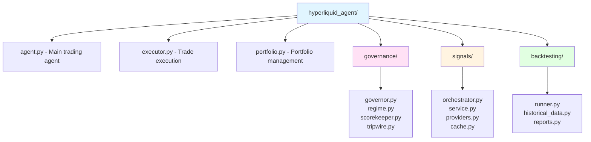

# API Reference

Welcome to the Hyperliquid Trading Agent API Reference. This section provides detailed documentation of the Python modules, classes, and functions that make up the trading agent.

## Overview

The trading agent is organized into several key modules:

- **[Core](/api/core)** - Main agent, executor, and portfolio management
- **[Governance](/api/governance)** - Strategy governance, regime detection, and risk controls
- **[Signals](/api/signals)** - Signal collection, processing, and caching
- **[Backtesting](/api/backtesting)** - Historical simulation and performance analysis

## Module Organization



## Usage Patterns

### Basic Agent Usage

```python
from hyperliquid_agent.agent import TradingAgent
from hyperliquid_agent.config import load_config

# Load configuration
config = load_config("config.toml")

# Initialize agent
agent = TradingAgent(config)

# Run single cycle
await agent.run_cycle()
```

### Governed Agent Usage

```python
from hyperliquid_agent.governed_agent import GovernedAgent
from hyperliquid_agent.config import load_config

# Load configuration
config = load_config("config.toml")

# Initialize governed agent
agent = GovernedAgent(config)

# Run with governance
await agent.run_cycle()
```

### Backtesting Usage

```python
from hyperliquid_agent.backtesting.runner import BacktestRunner
from hyperliquid_agent.backtesting.models import BacktestConfig

# Configure backtest
config = BacktestConfig(
    start_date="2024-01-01",
    end_date="2024-03-31",
    initial_capital=10000.0
)

# Run backtest
runner = BacktestRunner(config)
results = await runner.run()
```

## Type Hints

All modules use Python type hints for better IDE support and type checking. Key types include:

- `TradeAction` - Represents a trade decision
- `ExecutionResult` - Result of trade execution
- `PortfolioState` - Current portfolio state
- `SignalData` - Signal collection result
- `RegimeType` - Market regime classification

## Error Handling

Most functions raise specific exceptions that you should handle:

- `ConfigurationError` - Invalid configuration
- `ExecutionError` - Trade execution failure
- `ValidationError` - Invalid input data
- `APIError` - Hyperliquid API errors

## See Also

- [Architecture Overview](/architecture/overview) - High-level system design
- [Getting Started](/guide/getting-started) - Quick start guide
- [Configuration](/guide/configuration) - Configuration reference
