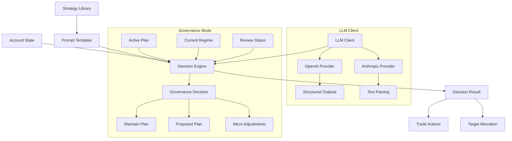

# Decision Engine

## Overview

The Decision Engine is the AI-powered core of the trading agent that analyzes market conditions, portfolio state, and available strategies to generate trading decisions. It uses Large Language Models (LLMs) to process complex market data and produce structured trading actions or portfolio allocations.

The engine operates in two modes:

- **Standard Mode**: Direct trading decisions based on current state and available strategies
- **Governance Mode**: Plan-aware decisions that respect governance constraints and minimize strategy thrash

## Architecture Diagram



## Key Concepts

### LLM Client Architecture

The `LLMClient` class provides a unified interface for interacting with different LLM providers, abstracting away provider-specific API differences.

**Provider Abstraction**

The client supports multiple LLM providers through a common interface:

- **OpenAI**: GPT-4, GPT-4o, GPT-5, o1, o3-mini models
- **Anthropic**: Claude 3 family (Opus, Sonnet, Haiku)

Each provider has different API patterns:

- OpenAI GPT-5 uses the `responses` API with structured outputs
- OpenAI GPT-4 and earlier use `chat.completions` API
- Anthropic uses the `messages` API with text-based responses

**Structured Outputs**

For OpenAI models, the client supports structured outputs using Pydantic schemas:

```python
from pydantic import BaseModel

class DecisionSchema(BaseModel):
    actions: list[TradeActionSchema]
    selected_strategy: str | None
    target_allocation: dict[str, float] | None

# Query with schema for guaranteed JSON structure
response = client.query(prompt, schema=DecisionSchema)
parsed = json.loads(response.content)
```

This ensures the LLM returns valid JSON matching the expected structure, reducing parsing errors.

**Cost Tracking**

The client automatically tracks token usage and calculates costs:

```python
client = LLMClient(config)
response = client.query("Analyze this market...")

print(f"Input tokens: {response.input_tokens}")
print(f"Output tokens: {response.output_tokens}")
print(f"Cost: ${response.cost_usd:.6f}")

# Get cumulative totals
summary = client.get_cost_summary()
print(f"Total calls: {summary['total_calls']}")
print(f"Total cost: ${summary['total_cost_usd']:.2f}")
```

Pricing is maintained for all supported models and updated regularly.

## Implementation Details

### LLM Client Usage

**Basic Query**

```python
from hyperliquid_agent.llm_client import LLMClient
from hyperliquid_agent.config import LLMConfig

config = LLMConfig(
    provider="openai",
    model="gpt-4o",
    api_key="sk-...",
    temperature=0.7,
    max_tokens=2000
)

client = LLMClient(config)
response = client.query("What is the capital of France?")
print(response.content)  # "Paris"
```

**Structured Outputs**

```python
from pydantic import BaseModel

class AnalysisSchema(BaseModel):
    sentiment: str
    confidence: float
    reasoning: str

response = client.query(
    "Analyze BTC market sentiment",
    schema=AnalysisSchema
)

# Response is guaranteed to match schema
data = json.loads(response.content)
print(data["sentiment"])  # "bullish"
print(data["confidence"])  # 0.75
```

**Provider Switching**

```python
# Switch to Anthropic
config = LLMConfig(
    provider="anthropic",
    model="claude-3-5-sonnet-20241022",
    api_key="sk-ant-...",
    temperature=0.7,
    max_tokens=2000
)

client = LLMClient(config)
# Same interface, different provider
response = client.query(prompt)
```

### Prompt Template System

The `PromptTemplate` class manages prompt formatting and strategy loading.

**Template Structure**

Templates use Python string formatting with named placeholders:

```python
template = """
You are a trading agent.

Portfolio Value: {portfolio_value}
Available Balance: {available_balance}
Timestamp: {timestamp}

Positions:
{positions}

Strategies:
{strategies}

Provide your decision as JSON...
"""
```

**Variable Substitution**

The template automatically substitutes variables from account state:

```python
template = PromptTemplate("prompts/default.txt", "strategies")
prompt = template.format(account_state)

# Variables replaced:
# {portfolio_value} -> "10000.00"
# {available_balance} -> "5000.00"
# {positions} -> "BTC (perp): Size=0.1, Entry=$50000..."
# {strategies} -> "Strategy: Funding Harvest..."
```

**Strategy Loading**

Strategies are loaded from markdown files with frontmatter metadata:

```markdown
---
title: "Funding Harvest"
id: "funding-harvest"
risk_profile: "low"
markets: ["BTC", "ETH"]
intended_horizon: "hours"
minimum_dwell_minutes: 120
compatible_regimes: ["carry-friendly"]
---

# Strategy Description
Entry when funding rate > 0.01%...
```

The template extracts metadata and content, formatting them for the LLM:

```python
template = PromptTemplate("prompts/default.txt", "strategies")
print(len(template.strategies))  # 12

# Strategies formatted with metadata
formatted = template._format_strategies()
```

**Customization Guide**

To customize prompts:

1. **Edit Template Files**: Modify `prompts/default.txt` or `prompts/governance.txt`
2. **Add Variables**: Use `{variable_name}` syntax
3. **Update Formatting**: Modify `_format_positions()` or `_format_strategies()` methods
4. **Test Changes**: Run agent with new template and verify LLM responses

Example custom template:

```python
template = """
You are a conservative trading agent focused on capital preservation.

STRICT RULES:
- Maximum 2x leverage
- No positions during high volatility
- Always maintain 50% cash reserve

Current State:
{portfolio_value}
{positions}

Available Strategies (filtered for low risk):
{strategies}

Decision (JSON):
"""
```

### Decision Parsing and Validation

The `DecisionEngine` parses LLM responses into structured `DecisionResult` objects.

**JSON Parsing**

The engine handles various LLM response formats:

```python
# Pure JSON
response = '{"actions": [...], "selected_strategy": "funding-harvest"}'

# JSON in markdown code blocks
response = '''```json
{"actions": [...]}
```'''

# JSON with surrounding text
response = '''Here's my analysis:
{"actions": [...]}
I recommend this approach because...'''

# All formats parsed correctly
result = engine.get_decision(account_state)
```

**Action Validation**

Each action is validated for required fields and correct types:

```python
# Valid action
{
    "action_type": "buy",  # Must be: buy, sell, hold, close, transfer
    "coin": "BTC",         # Required
    "market_type": "perp", # Must be: spot, perp
    "size": 0.1,          # Optional float
    "price": 50000.0,     # Optional float
    "reasoning": "..."    # Optional string
}

# Invalid actions are skipped
{
    "action_type": "invalid",  # ❌ Invalid type
    "coin": "",               # ❌ Empty coin
    "market_type": "futures"  # ❌ Invalid market type
}
```

**Error Handling**

The engine provides structured error handling:

```python
result = engine.get_decision(account_state)

if not result.success:
    print(f"Decision failed: {result.error}")
    # Fallback to safe default (hold)
else:
    for action in result.actions:
        print(f"{action.action_type} {action.coin}")
```

**LLM Error Format**

The LLM can explicitly signal errors:

```json
{
  "error": true,
  "error_reason": "Insufficient data to make decision",
  "actions": []
}
```

This is parsed and returned as a failed decision:

```python
result = engine.get_decision(account_state)
# result.success = False
# result.error = "LLM decision error: Insufficient data..."
```

### Token Usage and Cost Tracking

The engine tracks all LLM calls and cumulative costs.

**Cost Calculation**

Costs are calculated based on current pricing (per million tokens):

| Provider | Model | Input | Output |
|----------|-------|-------|--------|
| OpenAI | gpt-4o | $2.50 | $10.00 |
| OpenAI | gpt-4o-mini | $0.15 | $0.60 |
| OpenAI | gpt-5-mini | $0.25 | $2.00 |
| OpenAI | o3-mini | $1.10 | $4.40 |
| Anthropic | claude-3-5-sonnet | $3.00 | $15.00 |
| Anthropic | claude-3-5-haiku | $0.80 | $4.00 |

```python
# Automatic cost calculation
response = client.query(prompt)
cost = response.cost_usd

# Example: 1000 input tokens, 500 output tokens with gpt-4o
# Input: (1000 / 1,000,000) * $2.50 = $0.0025
# Output: (500 / 1,000,000) * $10.00 = $0.0050
# Total: $0.0075
```

**Running Totals**

The client maintains cumulative statistics:

```python
client = LLMClient(config)

# Make multiple calls
for i in range(10):
    client.query(f"Analyze market {i}")

# Get summary
summary = client.get_cost_summary()
print(f"Total calls: {summary['total_calls']}")           # 10
print(f"Total input tokens: {summary['total_input_tokens']}")   # 15000
print(f"Total output tokens: {summary['total_output_tokens']}") # 8000
print(f"Total cost: ${summary['total_cost_usd']:.2f}")         # $0.12
print(f"Avg cost/call: ${summary['avg_cost_per_call']:.4f}")   # $0.0120
```

**Cost Optimization Tips**

1. **Use Smaller Models**: gpt-4o-mini is 10x cheaper than gpt-4o for many tasks
2. **Reduce Max Tokens**: Set `max_tokens` to minimum needed (500-1000 for decisions)
3. **Optimize Prompts**: Shorter prompts = lower input costs
4. **Cache Strategies**: Load strategy content once, reuse across calls
5. **Batch Decisions**: Make fewer, more comprehensive decisions vs frequent small ones

Example optimization:

```python
# Expensive: Full strategy content every call
config = LLMConfig(model="gpt-4o", max_tokens=2000)
# Cost per call: ~$0.015

# Optimized: Smaller model, reduced tokens
config = LLMConfig(model="gpt-4o-mini", max_tokens=800)
# Cost per call: ~$0.001 (15x cheaper)
```

## Data Flow

### Standard Decision Flow

1. **Account State Collection**: Current portfolio, positions, balances
2. **Prompt Formatting**: Template populated with state and strategies
3. **LLM Query**: Prompt sent to configured provider
4. **Response Parsing**: JSON extracted and validated
5. **Action Creation**: TradeAction objects created from parsed data
6. **Result Return**: DecisionResult with actions and metadata

```python
# Step 1: Collect state
account_state = monitor.get_account_state()

# Step 2-5: Engine handles internally
result = engine.get_decision(account_state)

# Step 6: Use result
if result.success:
    for action in result.actions:
        executor.execute_action(action)
```

### Governance Decision Flow

1. **Context Assembly**: Account state + active plan + regime + review status
2. **Governance Prompt**: Special template with plan persistence rules
3. **LLM Query**: Prompt sent with governance constraints
4. **Response Parsing**: Extract maintain_plan flag and optional proposed plan
5. **Plan Validation**: Verify proposed plan meets governance requirements
6. **Result Return**: GovernanceDecisionResult with plan or micro-adjustments

```python
# Governance-aware decision
result = engine.get_decision_with_governance(
    account_state=state,
    active_plan=current_plan,
    current_regime="carry-friendly",
    can_review=True
)

if result.maintain_plan:
    # Execute micro-adjustments within plan
    if result.micro_adjustments:
        for action in result.micro_adjustments:
            executor.execute_action(action)
else:
    # Proposed plan change
    if result.proposed_plan:
        governor.evaluate_plan_change(result.proposed_plan)
```

## Configuration

### LLM Configuration

Configure the LLM client in `config.toml`:

```toml
[llm]
provider = "openai"              # "openai" or "anthropic"
model = "gpt-4o"                 # Model name
api_key = "${OPENAI_API_KEY}"    # API key (use env var)
temperature = 0.7                # 0.0-1.0 (lower = more deterministic)
max_tokens = 1500                # Maximum response tokens
```

### Supported Models

**OpenAI**

- `gpt-4o`: Latest GPT-4 optimized model (recommended)
- `gpt-4o-mini`: Faster, cheaper variant
- `gpt-5-mini-2025-08-07`: GPT-5 mini with structured outputs
- `gpt-5-2025-08-07`: Full GPT-5 model
- `o3-mini`: Reasoning-focused model
- `gpt-4-turbo`: Previous generation
- `gpt-4`: Original GPT-4

**Anthropic**

- `claude-3-5-sonnet-20241022`: Latest Sonnet (recommended)
- `claude-3-5-haiku-20241022`: Fast, efficient variant
- `claude-3-opus-20240229`: Most capable model
- `claude-3-sonnet-20240229`: Balanced performance
- `claude-3-haiku-20240307`: Fastest, cheapest

### Temperature Settings

Temperature controls randomness in LLM responses:

- `0.0-0.3`: Deterministic, consistent decisions (recommended for production)
- `0.4-0.7`: Balanced creativity and consistency
- `0.8-1.0`: More creative, varied responses (use for exploration)

```toml
[llm]
temperature = 0.3  # Conservative, repeatable decisions
```

### Prompt Templates

Customize decision-making by editing prompt templates:

- `prompts/default.txt`: Standard trading decisions
- `prompts/governance.txt`: Governance-aware decisions

Templates support variable substitution and strategy loading.

## Examples

### Basic Decision Engine

```python
from hyperliquid_agent.decision import DecisionEngine, PromptTemplate
from hyperliquid_agent.config import LLMConfig

# Configure LLM
llm_config = LLMConfig(
    provider="openai",
    model="gpt-4o-mini",
    api_key="sk-...",
    temperature=0.5,
    max_tokens=1000
)

# Load prompt template
template = PromptTemplate(
    template_path="prompts/default.txt",
    strategies_dir="strategies"
)

# Create engine
engine = DecisionEngine(llm_config, template)

# Get decision
result = engine.get_decision(account_state)

if result.success:
    print(f"Strategy: {result.selected_strategy}")
    print(f"Actions: {len(result.actions)}")
    print(f"Cost: ${result.cost_usd:.6f}")
    
    for action in result.actions:
        print(f"  {action.action_type} {action.coin}: {action.reasoning}")
else:
    print(f"Decision failed: {result.error}")
```

### Target Allocation Decision

```python
result = engine.get_decision(account_state)

if result.target_allocation:
    print("Target Allocation:")
    for coin, pct in result.target_allocation.items():
        print(f"  {coin}: {pct:.1f}%")
    
    # Portfolio manager will generate optimal trade sequence
    portfolio_manager.rebalance_to_target(result.target_allocation)
```

### Governance-Aware Decision

```python
from hyperliquid_agent.governance.governor import Governor

governor = Governor(config)
active_plan = governor.get_active_plan()
current_regime = governor.classify_regime(market_data)
can_review = governor.can_review_plan()

result = engine.get_decision_with_governance(
    account_state=state,
    active_plan=active_plan,
    current_regime=current_regime,
    can_review=can_review
)

if result.maintain_plan:
    print(f"Maintaining plan: {result.reasoning}")
    if result.micro_adjustments:
        print(f"Micro-adjustments: {len(result.micro_adjustments)}")
else:
    print(f"Proposing plan change: {result.reasoning}")
    if result.proposed_plan:
        print(f"New strategy: {result.proposed_plan.strategy_name}")
        print(f"Expected edge: {result.proposed_plan.expected_edge_bps} bps")
```

### Cost Monitoring

```python
# Track costs over time
engine = DecisionEngine(llm_config, template)

for i in range(100):
    result = engine.get_decision(account_state)
    
    if i % 10 == 0:
        print(f"Call {i}: ${result.cost_usd:.6f}")

# Final summary
print(f"\nTotal calls: {engine.total_calls}")
print(f"Total cost: ${engine.total_cost_usd:.2f}")
print(f"Avg cost: ${engine.total_cost_usd / engine.total_calls:.6f}")
```

## Performance Considerations

### Latency

LLM calls are the primary latency bottleneck:

- **OpenAI GPT-4o**: 1-3 seconds typical
- **OpenAI GPT-4o-mini**: 0.5-1.5 seconds typical
- **Anthropic Claude**: 1-4 seconds typical

Optimize by:

1. Using faster models (mini variants)
2. Reducing max_tokens
3. Caching strategy content
4. Making decisions less frequently

### Cost Management

Monitor and control LLM costs:

```python
# Set cost alerts
if engine.total_cost_usd > 10.0:
    logger.warning(f"LLM costs exceeded $10: ${engine.total_cost_usd:.2f}")
    # Switch to cheaper model
    engine.llm_config.model = "gpt-4o-mini"

# Daily cost tracking
daily_cost = engine.total_cost_usd
if daily_cost > daily_budget:
    # Reduce decision frequency or switch models
    pass
```

### Prompt Optimization

Reduce costs by optimizing prompts:

```python
# Before: Full strategy content (5000 tokens)
template = PromptTemplate("prompts/default.txt", "strategies")

# After: Strategy summaries only (1500 tokens)
# Edit template to include only metadata, not full content
# Cost reduction: ~70%
```

## Troubleshooting

### Common Parsing Errors

**Issue**: "No JSON object found in response"

**Cause**: LLM returned text without JSON

**Solution**:
```python
# Check raw response
print(result.raw_response)

# Verify prompt includes JSON format instructions
# Ensure temperature isn't too high (> 0.8)
# Try structured outputs (OpenAI only)
```

**Issue**: "Invalid JSON in response"

**Cause**: LLM returned malformed JSON

**Solution**:
```python
# Use structured outputs to guarantee valid JSON
schema = DecisionSchema
response = client.query(prompt, schema=schema)

# Or add explicit JSON validation to prompt:
# "Return ONLY valid JSON, no additional text"
```

### Invalid Action Handling

**Issue**: Actions missing required fields

**Cause**: LLM didn't follow action schema

**Solution**:
```python
# Validate actions before execution
valid_actions = [
    action for action in result.actions
    if action.coin and action.action_type in ["buy", "sell", "close"]
]

# Use structured outputs for guaranteed schema compliance
```

### Empty Responses

**Issue**: LLM returns empty response

**Cause**: API error, rate limiting, or model refusal

**Solution**:
```python
# Check for empty response
if not result.success or not result.actions:
    logger.error(f"Empty decision: {result.error}")
    # Fallback to safe default
    return DecisionResult(
        actions=[TradeAction(action_type="hold", coin="USDC", market_type="spot")],
        success=True
    )

# Check API status and rate limits
# Verify API key is valid
# Review prompt for policy violations
```

### Debugging Tips

1. **Enable Debug Logging**:
```python
import logging
logging.basicConfig(level=logging.DEBUG)
# See detailed LLM calls and responses
```

2. **Inspect Raw Responses**:
```python
result = engine.get_decision(account_state)
print("Raw LLM response:")
print(result.raw_response)
```

3. **Test Prompts Manually**:
```python
# Format prompt without calling LLM
prompt = template.format(account_state)
print(prompt)
# Copy to LLM playground for testing
```

4. **Validate Schemas**:
```python
# Test schema with sample data
from pydantic import ValidationError

try:
    decision = DecisionSchema(
        actions=[{"action_type": "buy", "coin": "BTC"}],
        selected_strategy="test"
    )
except ValidationError as e:
    print(e)
```

## Related Documentation

- [Governance System](/architecture/governance) - Plan-aware decision making
- [Portfolio Management](/architecture/portfolio) - Executing decisions
- [Configuration Guide](/guide/configuration) - LLM configuration options
- [Troubleshooting](/guide/troubleshooting) - Common issues and solutions
