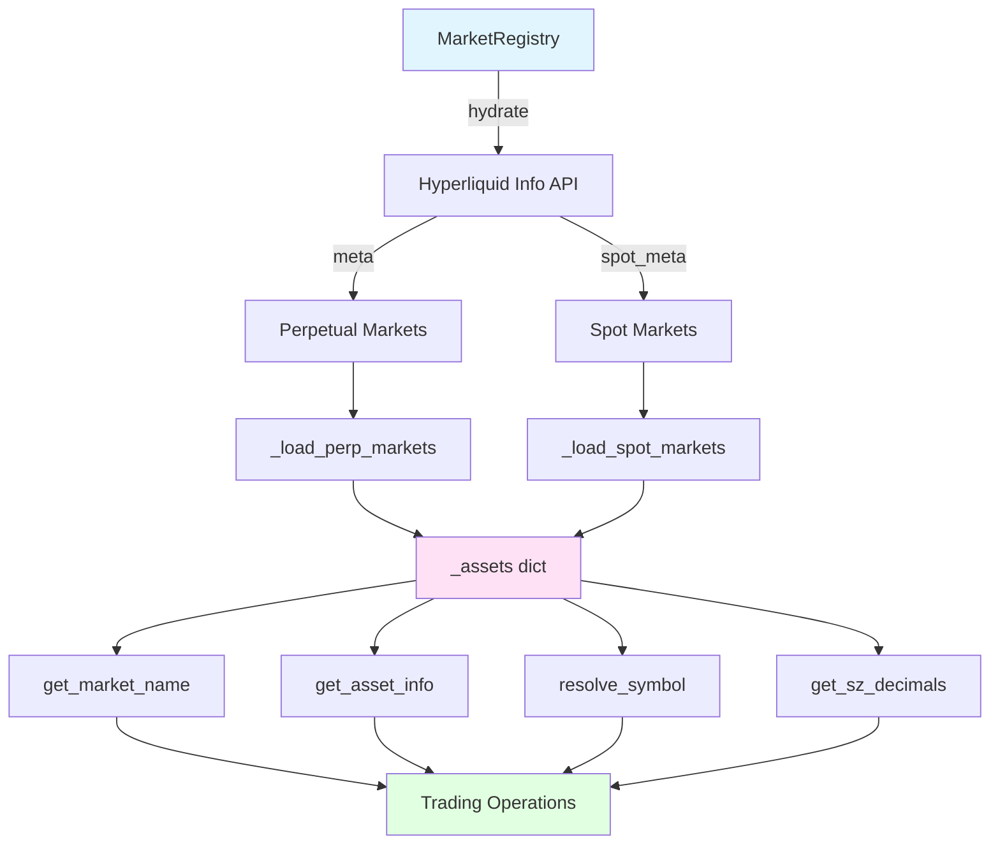
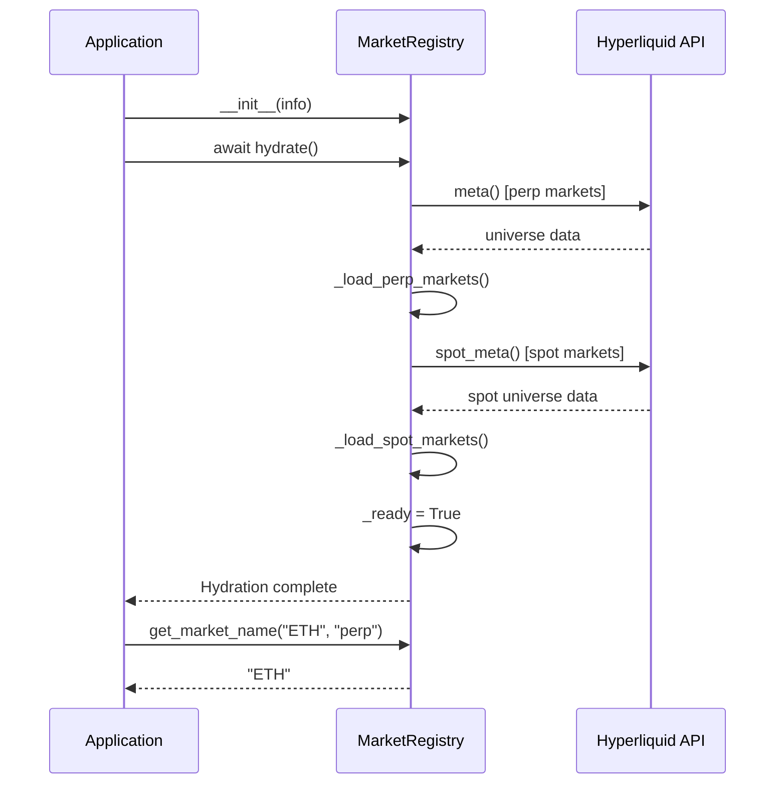

# Market Registry

## Overview

The Market Registry provides centralized symbol resolution and market metadata management for Hyperliquid spot and perpetual markets. It follows the "Security Master" pattern commonly used in professional trading systems, hydrating market metadata on startup and providing O(1) lookups for symbol resolution, market name retrieval, and metadata access.

The registry handles the complexities of Hyperliquid's different identifier schemes for spot and perpetual markets, normalizing symbols and providing a unified interface for trading operations.

## Architecture Diagram



## Key Concepts

### Market Types

Hyperliquid supports two market types with different naming conventions:

- **Perpetual Markets**: Direct symbol notation (e.g., "ETH", "BTC")
  - Used for leveraged perpetual futures contracts
  - Single identifier per asset
  - Settled in USDC

- **Spot Markets**: Pair notation or index (e.g., "ETH/USDC", "@123")
  - Used for physical delivery spot trading
  - Multiple pairs per asset (different quote currencies)
  - Direct asset ownership

### Symbol Normalization

The registry normalizes symbols to canonical form for consistent lookups:

```python
def _normalize_symbol(self, symbol: str) -> str:
    """Normalize symbol to canonical form."""
    # Remove whitespace and convert to uppercase
    normalized = symbol.strip().upper()
    
    # Handle special cases (e.g., "UETH" -> "ETH")
    if normalized.startswith("U") and len(normalized) > 1:
        without_u = normalized[1:]
        if without_u in self._assets:
            return without_u
    
    return normalized
```

**Normalization Rules**:

1. Strip whitespace
2. Convert to uppercase
3. Remove "U" prefix if it resolves to known asset (e.g., "UETH" → "ETH")

### Asset Market Info

The `AssetMarketInfo` dataclass provides unified access to both spot and perpetual market metadata:

```python
@dataclass
class AssetMarketInfo:
    base_symbol: str                        # Canonical symbol (e.g., "ETH")
    perp: PerpMarketInfo | None = None      # Perpetual market info
    spot_markets: list[SpotMarketInfo] = [] # Available spot markets
    
    @property
    def has_perp(self) -> bool:
        return self.perp is not None
    
    @property
    def has_spot(self) -> bool:
        return len(self.spot_markets) > 0
```

## Implementation Details

### Market Name Resolution Logic

The `get_market_name()` method handles the complexity of Hyperliquid's different naming schemes:

```python
def get_market_name(
    self,
    symbol: str,
    market_type: Literal["spot", "perp"],
    quote: str = "USDC"
) -> str:
    """Get the correct market identifier for order placement."""
    
    # 1. Normalize symbol
    normalized = self._normalize_symbol(symbol)
    
    # 2. Lookup asset
    asset = self._assets.get(normalized)
    if not asset:
        raise ValueError(f"Unknown asset: {symbol}")
    
    # 3. Return appropriate market name
    if market_type == "perp":
        if not asset.perp:
            raise ValueError(f"{symbol} not available on perpetual market")
        return asset.perp.market_name  # e.g., "ETH"
    
    # 4. For spot, find best match based on quote currency
    if not asset.spot_markets:
        raise ValueError(f"{symbol} not available on spot market")
    
    # Prefer requested quote currency
    quote_upper = quote.upper()
    for spot in asset.spot_markets:
        if quote_upper in spot.market_name.upper():
            return spot.market_name  # e.g., "ETH/USDC"
    
    # Fallback to first available spot market
    return asset.spot_markets[0].market_name
```

**Resolution Examples**:

| Input | Market Type | Quote | Output |
|-------|-------------|-------|--------|
| "ETH" | "perp" | - | "ETH" |
| "eth" | "perp" | - | "ETH" (normalized) |
| "ETH" | "spot" | "USDC" | "ETH/USDC" |
| "ETH" | "spot" | "USDT" | "ETH/USDT" |
| "BTC" | "spot" | "UNKNOWN" | "BTC/USDC" (fallback) |

### Spot vs Perp Naming

#### Perpetual Market Naming

Perpetual markets use direct symbol notation:

```python
# Perpetual market example
perp_info = PerpMarketInfo(
    market_name="ETH",      # Direct symbol
    asset_id=0,             # Internal asset ID
    sz_decimals=4,          # Size precision (0.0001 ETH)
    px_decimals=8           # Price precision
)
```

**API Usage**:

```python
# Place perpetual order
market_name = registry.get_market_name("ETH", "perp")
# Returns: "ETH"

executor.place_order(
    coin=market_name,  # "ETH"
    is_buy=True,
    sz=1.5,
    limit_px=2500.0
)
```

#### Spot Market Naming

Spot markets use pair notation with multiple possible identifiers:

```python
# Spot market example
spot_info = SpotMarketInfo(
    market_name="ETH/USDC",         # Preferred identifier
    base_token_idx=1,               # Base token index
    quote_token_idx=0,              # Quote token index
    sz_decimals=5,                  # Size precision
    px_decimals=6,                  # Price precision
    native_symbol="@1242",          # Exchange-native ID
    aliases=["ETH/USDC", "@1242"]   # All valid identifiers
)
```

**API Usage**:

```python
# Place spot order
market_name = registry.get_market_name("ETH", "spot", quote="USDC")
# Returns: "ETH/USDC"

executor.place_order(
    coin=market_name,  # "ETH/USDC"
    is_buy=True,
    sz=1.5,
    limit_px=2500.0
)
```

### Registry Lookup

The registry maintains multiple lookup dictionaries for O(1) access:

```python
class MarketRegistry:
    def __init__(self, info: Info):
        self._info = info
        
        # Primary storage: canonical symbol -> asset info
        self._assets: dict[str, AssetMarketInfo] = {}
        
        # Reverse lookups for fast resolution
        self._perp_by_name: dict[str, AssetMarketInfo] = {}
        self._spot_by_name: dict[str, AssetMarketInfo] = {}
        self._spot_market_by_identifier: dict[str, SpotMarketInfo] = {}
        
        self._ready = False
```

**Lookup Dictionaries**:

1. `_assets`: Canonical symbol → AssetMarketInfo
   - Primary storage
   - Example: `{"ETH": AssetMarketInfo(...)}`

2. `_perp_by_name`: Perp market name → AssetMarketInfo
   - Allows lookup by perpetual market name
   - Example: `{"ETH": AssetMarketInfo(...)}`

3. `_spot_by_name`: Spot identifier → AssetMarketInfo
   - Allows lookup by any spot identifier
   - Example: `{"ETH/USDC": AssetMarketInfo(...), "@1242": AssetMarketInfo(...)}`

4. `_spot_market_by_identifier`: Spot identifier → SpotMarketInfo
   - Direct access to spot market metadata
   - Example: `{"ETH/USDC": SpotMarketInfo(...)}`

## sz_decimals Rounding Requirements

### Decimal Precision

The `sz_decimals` field specifies the number of decimal places for size precision:

```python
@dataclass
class PerpMarketInfo:
    sz_decimals: int  # Number of decimals for size
```

**Examples**:

| Asset | sz_decimals | Minimum Size | Valid Sizes |
|-------|-------------|--------------|-------------|
| BTC | 5 | 0.00001 | 0.00001, 0.5, 1.23456 |
| ETH | 4 | 0.0001 | 0.0001, 1.5, 10.1234 |
| SOL | 1 | 0.1 | 0.1, 1.5, 100.0 |

### Rounding Rules

Order sizes must be rounded to the correct precision before submission:

```python
from decimal import Decimal, ROUND_DOWN

def round_size(size: float, sz_decimals: int) -> Decimal:
    """Round size to correct precision."""
    quantize_str = "1." + "0" * sz_decimals
    return Decimal(str(size)).quantize(
        Decimal(quantize_str),
        rounding=ROUND_DOWN
    )
```

**Rounding Direction**: Always round DOWN to avoid exceeding available balance or position limits.

### Calculation Examples

```python
# Example 1: BTC with sz_decimals=5
size = 1.234567
sz_decimals = 5
rounded = round_size(size, sz_decimals)
# Result: Decimal('1.23456')

# Example 2: ETH with sz_decimals=4
size = 10.12345
sz_decimals = 4
rounded = round_size(size, sz_decimals)
# Result: Decimal('10.1234')

# Example 3: SOL with sz_decimals=1
size = 99.87
sz_decimals = 1
rounded = round_size(size, sz_decimals)
# Result: Decimal('99.8')
```

### Getting sz_decimals

Use the `get_sz_decimals()` method to retrieve precision for a specific market:

```python
# Get sz_decimals for perpetual market
sz_decimals = registry.get_sz_decimals("ETH", "perp")
# Returns: 4

# Get sz_decimals for spot market
sz_decimals = registry.get_sz_decimals("ETH", "spot")
# Returns: 5 (may differ from perp)
```

### Usage in Order Placement

```python
from decimal import Decimal

# Calculate desired size
target_value_usd = 10000.0
eth_price = 2500.0
raw_size = target_value_usd / eth_price  # 4.0

# Get precision and round
sz_decimals = registry.get_sz_decimals("ETH", "perp")
rounded_size = round_size(raw_size, sz_decimals)

# Place order with correctly rounded size
executor.place_order(
    coin="ETH",
    is_buy=True,
    sz=float(rounded_size),  # 4.0000
    limit_px=2500.0
)
```

## Spot vs Perp Market Handling

### Market Type Differences

| Aspect | Perpetual | Spot |
|--------|-----------|------|
| **Identifier** | Direct symbol ("ETH") | Pair notation ("ETH/USDC") |
| **Settlement** | Cash-settled in USDC | Physical delivery |
| **Leverage** | Up to 50x | No leverage |
| **Funding** | Periodic funding payments | No funding |
| **Quote Currency** | Always USDC | Multiple (USDC, USDT, etc.) |
| **Position Type** | Long or short | Long only |

### API Differences

#### Perpetual API

```python
# Get perpetual market name
market_name = registry.get_market_name("ETH", "perp")
# Returns: "ETH"

# Get perpetual market info
asset = registry.get_asset_info("ETH")
if asset and asset.has_perp:
    perp_info = asset.perp
    print(f"Asset ID: {perp_info.asset_id}")
    print(f"Size decimals: {perp_info.sz_decimals}")
```

#### Spot API

```python
# Get spot market name
market_name = registry.get_market_name("ETH", "spot", quote="USDC")
# Returns: "ETH/USDC"

# Get spot market info
spot_info = registry.get_spot_market_info("ETH", quote="USDC")
print(f"Base token index: {spot_info.base_token_idx}")
print(f"Quote token index: {spot_info.quote_token_idx}")
print(f"Native symbol: {spot_info.native_symbol}")  # "@1242"
```

### Usage Examples

#### Trading Perpetuals

```python
# Initialize registry
registry = MarketRegistry(info)
await registry.hydrate()

# Get perpetual market name
coin = registry.get_market_name("ETH", "perp")

# Place perpetual order
executor.place_order(
    coin=coin,           # "ETH"
    is_buy=True,
    sz=1.5,
    limit_px=2500.0,
    reduce_only=False
)
```

#### Trading Spot

```python
# Get spot market name
coin = registry.get_market_name("ETH", "spot", quote="USDC")

# Place spot order
executor.place_order(
    coin=coin,           # "ETH/USDC"
    is_buy=True,
    sz=1.5,
    limit_px=2500.0
)
```

#### Handling Both Markets

```python
def place_order_any_market(
    symbol: str,
    market_type: Literal["spot", "perp"],
    size: float,
    price: float
):
    """Place order on either spot or perp market."""
    
    # Get market name
    market_name = registry.get_market_name(symbol, market_type)
    
    # Get size decimals
    sz_decimals = registry.get_sz_decimals(symbol, market_type)
    
    # Round size
    rounded_size = round_size(size, sz_decimals)
    
    # Place order
    executor.place_order(
        coin=market_name,
        is_buy=True,
        sz=float(rounded_size),
        limit_px=price
    )
```

## Registry Initialization and Hydration

### Async Hydration Process

The registry must be hydrated during application startup before any trading operations:

```python
async def hydrate(self) -> None:
    """Load all market metadata from Hyperliquid."""
    
    self._logger.info("Hydrating market registry...")
    
    try:
        # Load perpetual markets
        perp_count = await self._load_perp_markets()
        
        # Load spot markets
        spot_count = await self._load_spot_markets()
        
        # Mark as ready
        self._ready = True
        
        self._logger.info(
            f"Market registry hydrated successfully: "
            f"{len(self._assets)} unique assets, "
            f"{perp_count} perp markets, "
            f"{spot_count} spot markets"
        )
        
    except Exception as e:
        self._logger.error(f"Failed to hydrate market registry: {e}")
        raise
```

### Startup Sequence



### Perpetual Market Loading

```python
async def _load_perp_markets(self) -> int:
    """Load perpetual market metadata."""
    
    # Fetch metadata from API
    meta = await asyncio.to_thread(self._info.meta)
    universe = meta.get("universe", [])
    
    perp_count = 0
    for asset_data in universe:
        name = asset_data.get("name")
        if not name:
            continue
        
        # Normalize symbol
        base_symbol = name.upper()
        
        # Create or get asset entry
        if base_symbol not in self._assets:
            self._assets[base_symbol] = AssetMarketInfo(base_symbol=base_symbol)
        
        asset_info = self._assets[base_symbol]
        
        # Add perpetual market info
        asset_info.perp = PerpMarketInfo(
            market_name=name,
            asset_id=asset_data.get("assetId", 0),
            sz_decimals=asset_data.get("szDecimals", 0),
            px_decimals=8
        )
        
        # Add to reverse lookup
        self._perp_by_name[name] = asset_info
        self._perp_by_name[base_symbol] = asset_info
        
        perp_count += 1
    
    return perp_count
```

### Spot Market Loading

```python
async def _load_spot_markets(self) -> int:
    """Load spot market metadata."""
    
    # Fetch metadata from API
    spot_meta = await asyncio.to_thread(self._info.spot_meta)
    spot_universe = spot_meta.get("universe", [])
    tokens = spot_meta.get("tokens", [])
    
    spot_count = 0
    for spot_data in spot_universe:
        market_name = spot_data.get("name")
        token_pair = spot_data.get("tokens", [])
        
        if len(token_pair) != 2:
            continue
        
        base_token_idx, quote_token_idx = token_pair
        base_token = tokens[base_token_idx]
        quote_token = tokens[quote_token_idx]
        
        # Normalize base symbol
        raw_base_symbol = base_token.get("name", "")
        normalized_base_symbol = self._normalize_symbol(raw_base_symbol)
        
        # Create or get asset entry
        if normalized_base_symbol not in self._assets:
            self._assets[normalized_base_symbol] = AssetMarketInfo(
                base_symbol=normalized_base_symbol
            )
        
        asset_info = self._assets[normalized_base_symbol]
        
        # Add spot market info
        spot_info = SpotMarketInfo(
            market_name=f"{raw_base_symbol.upper()}/{quote_token.get('name', '').upper()}",
            base_token_idx=base_token_idx,
            quote_token_idx=quote_token_idx,
            sz_decimals=spot_data.get("szDecimals", 0),
            px_decimals=spot_data.get("pxDecimals", 8),
            native_symbol=market_name,
            aliases=[market_name]
        )
        
        asset_info.spot_markets.append(spot_info)
        
        # Add to reverse lookups
        self._spot_by_name[spot_info.market_name] = asset_info
        self._spot_market_by_identifier[spot_info.market_name.upper()] = spot_info
        
        spot_count += 1
    
    return spot_count
```

### Readiness Check

Always check if the registry is ready before using it:

```python
@property
def is_ready(self) -> bool:
    """Check if registry has been hydrated."""
    return self._ready

def get_market_name(self, symbol: str, market_type: str, quote: str = "USDC") -> str:
    if not self._ready:
        raise RuntimeError(
            "MarketRegistry not ready. Call await registry.hydrate() during startup."
        )
    # ... rest of implementation
```

### Troubleshooting Tips

#### Registry Not Hydrated

**Error**:
```
RuntimeError: MarketRegistry not ready. Call await registry.hydrate() during startup.
```

**Solution**:
```python
# Ensure hydration during startup
registry = MarketRegistry(info)
await registry.hydrate()  # Must be called before any operations
```

#### Hydration Timeout

**Error**:
```
Failed to hydrate market registry: TimeoutError
```

**Solution**:
- Check network connectivity to Hyperliquid API
- Increase timeout in Info client configuration
- Retry hydration with exponential backoff

#### Partial Hydration

**Symptom**: Some assets missing from registry

**Solution**:
```python
# Check hydration logs
self._logger.info(
    f"Market registry hydrated: "
    f"{len(self._assets)} assets, "
    f"{perp_count} perp markets, "
    f"{spot_count} spot markets"
)

# Verify expected assets are present
assert registry.get_asset_info("BTC") is not None
assert registry.get_asset_info("ETH") is not None
```

## Common Market Error Scenarios

### Symbol Not Found Errors

**Error**:
```python
ValueError: Unknown asset: INVALID
```

**Cause**: Symbol not recognized by registry

**Solutions**:

1. **Check symbol spelling**:
   ```python
   # Wrong
   market_name = registry.get_market_name("ETHERIUM", "perp")
   
   # Correct
   market_name = registry.get_market_name("ETH", "perp")
   ```

2. **Verify asset exists on Hyperliquid**:
   ```python
   asset = registry.get_asset_info("NEWCOIN")
   if asset is None:
       print("Asset not available on Hyperliquid")
   ```

3. **List available assets**:
   ```python
   available_assets = list(registry._assets.keys())
   print(f"Available: {available_assets[:10]}")
   ```

### Decimal Precision Errors

**Error**:
```
Order rejected: Invalid size precision
```

**Cause**: Size not rounded to correct decimal places

**Solution**:
```python
# Wrong: Using raw float
executor.place_order(coin="ETH", sz=1.23456789, ...)

# Correct: Round to sz_decimals
sz_decimals = registry.get_sz_decimals("ETH", "perp")
rounded_size = round_size(1.23456789, sz_decimals)
executor.place_order(coin="ETH", sz=float(rounded_size), ...)
```

### Market Type Mismatches

**Error**:
```python
ValueError: ETH not available on spot market
```

**Cause**: Requesting market type that doesn't exist for asset

**Solution**:
```python
# Check market availability before trading
asset = registry.get_asset_info("ETH")

if asset.has_perp:
    perp_name = registry.get_market_name("ETH", "perp")
    # Trade perpetual

if asset.has_spot:
    spot_name = registry.get_market_name("ETH", "spot")
    # Trade spot
```

### Quote Currency Not Found

**Error**: Returns fallback market instead of requested quote

**Cause**: Requested quote currency not available for asset

**Solution**:
```python
# Check available spot markets
asset = registry.get_asset_info("ETH")
for spot in asset.spot_markets:
    print(f"Available: {spot.market_name}")
# Output: ETH/USDC, ETH/USDT

# Request available quote
market_name = registry.get_market_name("ETH", "spot", quote="USDC")  # ✓
market_name = registry.get_market_name("ETH", "spot", quote="DAI")   # Falls back to first
```

### Registry Refresh Failures

**Error**:
```
Failed to refresh registry, restoring old state
```

**Cause**: Network error during refresh operation

**Solution**:
```python
try:
    await registry.refresh()
except Exception as e:
    logger.error(f"Registry refresh failed: {e}")
    # Old state is automatically restored
    # Continue using cached data
```

## Performance Considerations

### Lookup Complexity

All registry lookups are O(1) dictionary operations:

```python
# O(1) lookups
asset = registry.get_asset_info("ETH")           # Dict lookup
market_name = registry.get_market_name("ETH", "perp")  # Dict lookup
sz_decimals = registry.get_sz_decimals("ETH", "perp")  # Dict lookup
```

### Memory Usage

Registry memory footprint scales linearly with number of markets:

- **Typical size**: ~100-200 assets × 2-3 markets each = ~300-600 market entries
- **Memory per entry**: ~1-2 KB
- **Total memory**: ~300-1200 KB (~1 MB)

### Hydration Performance

Initial hydration requires two API calls:

```python
# Hydration timing
meta = await asyncio.to_thread(self._info.meta)           # ~200-500ms
spot_meta = await asyncio.to_thread(self._info.spot_meta) # ~200-500ms
# Total: ~400-1000ms
```

**Optimization**: Hydrate once at startup, not per-request

### Refresh Strategy

Refresh registry periodically to pick up new markets:

```python
# Refresh every 24 hours
async def periodic_refresh():
    while True:
        await asyncio.sleep(86400)  # 24 hours
        try:
            await registry.refresh()
        except Exception as e:
            logger.error(f"Registry refresh failed: {e}")
```

## Related Documentation

- [Trade Executor](../api/core.md#tradeexecutor) - Uses registry for order placement
- [Position Monitor](./monitoring.md) - Uses registry for price lookups
- [Configuration Guide](../guide/configuration.md) - Registry settings
- [Troubleshooting](../guide/troubleshooting.md) - Common registry issues

## Example: Complete Registry Usage

```python
import asyncio
from hyperliquid.info import Info
from hyperliquid_agent.market_registry import MarketRegistry
from hyperliquid_agent.executor import TradeExecutor

async def main():
    # Initialize components
    info = Info(skip_ws=True)
    registry = MarketRegistry(info)
    
    # Hydrate registry (required before use)
    await registry.hydrate()
    print(f"Registry ready: {registry.is_ready}")
    
    # Get asset information
    eth_asset = registry.get_asset_info("ETH")
    print(f"ETH has perp: {eth_asset.has_perp}")
    print(f"ETH has spot: {eth_asset.has_spot}")
    
    # Get market names for trading
    perp_name = registry.get_market_name("ETH", "perp")
    spot_name = registry.get_market_name("ETH", "spot", quote="USDC")
    print(f"Perp market: {perp_name}")  # "ETH"
    print(f"Spot market: {spot_name}")  # "ETH/USDC"
    
    # Get size decimals for rounding
    perp_decimals = registry.get_sz_decimals("ETH", "perp")
    spot_decimals = registry.get_sz_decimals("ETH", "spot")
    print(f"Perp sz_decimals: {perp_decimals}")  # 4
    print(f"Spot sz_decimals: {spot_decimals}")  # 5
    
    # Resolve ambiguous symbols
    result = registry.resolve_symbol("ETH")
    if result:
        base_symbol, market_type = result
        print(f"Resolved: {base_symbol} on {market_type}")  # "ETH" on "perp"
    
    result = registry.resolve_symbol("ETH/USDC")
    if result:
        base_symbol, market_type = result
        print(f"Resolved: {base_symbol} on {market_type}")  # "ETH" on "spot"

if __name__ == "__main__":
    asyncio.run(main())
```

**Expected Output**:

```
Registry ready: True
ETH has perp: True
ETH has spot: True
Perp market: ETH
Spot market: ETH/USDC
Perp sz_decimals: 4
Spot sz_decimals: 5
Resolved: ETH on perp
Resolved: ETH on spot
```
