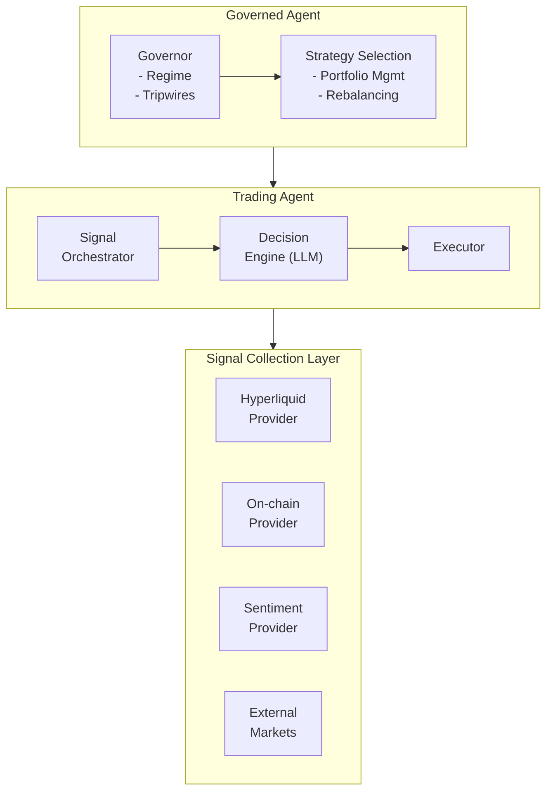

# Architecture Overview

## System Components

The Hyperliquid Trading Agent consists of several interconnected modules:

## Core Modules

### Signal System
- **Orchestrator**: Coordinates parallel signal collection
- **Providers**: Fetch data from various sources
- **Cache**: SQLite-based caching for efficiency
- **Processor**: Calculates derived metrics

### Decision Engine
- **LLM Client**: Interfaces with AI models
- **Decision Module**: Generates trading decisions
- **Context Builder**: Prepares market context for LLM

### Execution Layer
- **Executor**: Places and manages orders
- **Monitor**: Tracks positions and performance
- **Market Registry**: Manages tradeable assets

### Governance System
- **Governor**: Orchestrates strategy selection
- **Regime Classifier**: Detects market conditions
- **Scorekeeper**: Tracks strategy performance
- **Tripwires**: Implements risk controls

## Data Flow

1. **Collection**: Signal providers fetch data in parallel
2. **Processing**: Raw signals are calculated and cached
3. **Analysis**: LLM receives processed signals and context
4. **Decision**: Trading decision is generated
5. **Execution**: Orders are placed on Hyperliquid
6. **Monitoring**: Positions are tracked and evaluated
7. **Governance**: Performance informs strategy selection

## Key Design Principles

- **Modularity**: Each component has clear responsibilities
- **Async Operations**: Parallel signal collection for speed
- **Caching**: Minimize API calls and improve performance
- **Extensibility**: Easy to add new signals and strategies
- **Observability**: Comprehensive logging and monitoring
