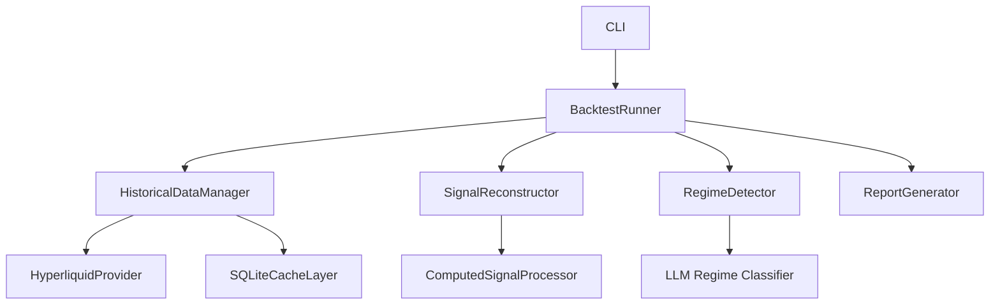

# Backtesting Guide

## Overview

The backtesting system allows you to validate regime detection and strategy performance using historical Hyperliquid data. It reconstructs market signals from historical OHLCV candles, funding rates, and order book data to simulate how the governance system would have classified market regimes in the past.

## Architecture Overview

The backtesting framework consists of 7 core modules:



**Key Components:**

- **BacktestRunner**: Orchestrates the entire backtest execution, coordinates data fetching, signal reconstruction, and regime classification
- **HistoricalDataManager**: Fetches historical candles and funding rates from Hyperliquid API with pagination, retry logic, and caching
- **SignalReconstructor**: Transforms raw historical data into RegimeSignals format by calculating technical indicators (SMA, ADX, volatility)
- **RegimeDetector**: Classifies market regimes using the same logic as live trading (trending, range-bound, carry-friendly, event-risk)
- **ReportGenerator**: Produces summary statistics, CSV exports, and visualizations for analysis

**Data Flow:**

1. Generate timestamp sequence based on interval (1h, 4h, 1d)
2. Pre-fetch all historical data in batch (candles + funding rates)
3. Iterate through timestamps and reconstruct signals at each point
4. Classify regime using RegimeDetector
5. Collect results and generate reports

## Quickstart: Your First Backtest

### Prerequisites

- Configured `config.toml` with Hyperliquid API access
- Governance section configured (required for regime detection)
- Python 3.11+ with `uv` package manager

### Step 1: Basic Backtest Command

Run a 3-month backtest with default settings:

```bash
uv run python -m hyperliquid_agent.cli backtest \
  --start-date 2024-01-01 \
  --end-date 2024-03-31
```

This will:
- Use 4-hour candles (default interval)
- Track BTC and ETH (default assets)
- Save results to `./backtest_results/`
- Generate summary report, CSV data, and visualization

### Step 2: View Results

After completion, check the output directory:

```bash
ls -la backtest_results/
# summary.txt      - Text summary with regime distribution and transitions
# results.csv      - Detailed CSV with all data points and signals
# timeline.png     - Visual timeline of regime classifications
```

**Example Summary Output:**

```
================================================================================
BACKTEST SUMMARY REPORT
================================================================================

Configuration:
  Start Date: 2024-01-01 00:00:00
  End Date: 2024-03-31 00:00:00
  Interval: 4h
  Assets: BTC, ETH

Data Quality:
  Total Points: 540
  Collected Points: 532
  Skipped Points: 8
  Skip Rate: 1.5%
  Overall Avg Confidence: 0.847

Regime Distribution:
  trending-bull       :  42.11%
  range-bound         :  31.58%
  trending-bear       :  18.42%
  carry-friendly      :   5.26%
  event-risk          :   2.63%

Regime Transitions (87 total):
    1. 2024-01-03 08:00 | range-bound     -> trending-bull   (confidence: 0.850)
    2. 2024-01-15 16:00 | trending-bull   -> range-bound     (confidence: 0.720)
    ...
```

### Step 3: Customize Your Backtest

**Use hourly candles for more granular data:**

```bash
uv run python -m hyperliquid_agent.cli backtest \
  --start-date 2024-06-01 \
  --end-date 2024-07-01 \
  --interval 1h
```

**Track specific assets:**

```bash
uv run python -m hyperliquid_agent.cli backtest \
  --start-date 2024-01-01 \
  --end-date 2024-03-31 \
  --assets BTC,ETH,SOL,ARB
```

**Save to custom directory:**

```bash
uv run python -m hyperliquid_agent.cli backtest \
  --start-date 2024-01-01 \
  --end-date 2024-03-31 \
  --output ./my_backtest_results
```

**Clear cache before running (useful if data seems stale):**

```bash
uv run python -m hyperliquid_agent.cli backtest \
  --start-date 2024-01-01 \
  --end-date 2024-03-31 \
  --clear-cache
```

## Historical Data Fetching

### Data Sources

The backtesting system fetches historical data from Hyperliquid's public API:

**OHLCV Candles:**
- Endpoint: `/info` → `candles_snapshot`
- Available intervals: 1m, 5m, 15m, 1h, 4h, 1d
- Limit: 5000 most recent candles per request
- Data includes: open, high, low, close, volume, timestamp

**Funding Rates:**
- Endpoint: `/info` → `funding_history`
- Perpetual markets only
- Historical funding rate snapshots
- Data includes: rate, timestamp, premium

**Order Books:**
- Not available for historical backtesting
- Order book metrics will be zero in backtest results
- Only current order book is accessible via API

### Data Format

**Candle Data Structure:**

```python
@dataclass
class Candle:
    timestamp: datetime
    open: float
    high: float
    low: float
    close: float
    volume: float
```

**Funding Rate Data Structure:**

```python
@dataclass
class FundingRate:
    timestamp: datetime
    rate: float        # Decimal format (e.g., 0.0001 = 0.01%)
    premium: float     # Mark-index premium
```

### Fetching Examples

**Fetch candles for date range:**

```python
from hyperliquid_agent.backtesting.historical_data import HistoricalDataManager
from datetime import datetime

# Initialize manager
manager = HistoricalDataManager(hyperliquid_provider, cache)

# Fetch 4-hour candles for BTC
candles = await manager.fetch_candles_range(
    coin="BTC",
    interval="4h",
    start_time=datetime(2024, 1, 1),
    end_time=datetime(2024, 3, 31)
)

print(f"Fetched {len(candles)} candles")
# Output: Fetched 540 candles
```

**Fetch funding rates:**

```python
# Fetch funding rate history for ETH
funding_rates = await manager.fetch_funding_rates_range(
    coin="ETH",
    start_time=datetime(2024, 1, 1),
    end_time=datetime(2024, 3, 31)
)

print(f"Fetched {len(funding_rates)} funding rate snapshots")
```

### Caching Strategy

Historical data is cached in SQLite to avoid repeated API calls:

- **Cache TTL**: 7 days for historical data (immutable)
- **Cache Key Format**: `backtest:candles:{coin}:{interval}:{start}:{end}`
- **Cache Location**: `state/signal_cache.db` (configurable in `config.toml`)

**Cache Benefits:**
- Dramatically faster subsequent backtests
- Reduces API load on Hyperliquid
- Enables offline analysis

**Clear cache when:**
- Data seems stale or incorrect
- You suspect data corruption
- You want to force fresh data fetch

```bash
# Clear cache before backtest
uv run python -m hyperliquid_agent.cli backtest \
  --start-date 2024-01-01 \
  --end-date 2024-03-31 \
  --clear-cache
```

### API Limitations

**Hyperliquid Candle Limit:**
- Maximum 5000 most recent candles available
- Lookback period depends on interval:
  - 1h interval: ~208 days (5000 hours)
  - 4h interval: ~833 days (20,000 hours)
  - 1d interval: ~13.7 years (5000 days)

**Lookback Requirements:**
- Backtesting requires 50 additional periods for indicator calculations (SMA-50)
- Usable range = 5000 - 50 = 4950 candles
- Example: 4h interval allows ~825 days of usable backtest data

**Date Range Validation:**

The system automatically validates your date range against API limits:

```bash
# This will fail if range is too large
uv run python -m hyperliquid_agent.cli backtest \
  --start-date 2020-01-01 \
  --end-date 2024-12-31 \
  --interval 1h

# Error: Backtest date range too large for Hyperliquid API limitations.
#   Interval: 1h
#   Requested range: 1826 days
#   Maximum usable range: 206 days (after 50-period lookback)
#   Solutions:
#     1. Reduce date range to 206 days or less
#     2. Use a larger interval (4h gives ~825 days, 1d gives ~4950 days)
#     3. Move start date closer to present
```

## Performance Report Interpretation

### Key Metrics Explained

**Sharpe Ratio:**
- Measures risk-adjusted returns
- Formula: (Average Return - Risk-Free Rate) / Standard Deviation of Returns
- Interpretation:
  - < 1.0: Poor risk-adjusted performance
  - 1.0 - 2.0: Good performance
  - > 2.0: Excellent performance
- Note: Backtesting reports regime distribution, not trading performance

**Drawdown:**
- Maximum peak-to-trough decline
- Measures worst-case loss scenario
- Example: 15% drawdown means portfolio fell 15% from peak
- Lower is better

**Win Rate:**
- Percentage of profitable trades
- Formula: (Winning Trades / Total Trades) × 100
- Interpretation:
  - < 50%: Losing more often than winning
  - 50% - 60%: Average
  - > 60%: Strong win rate
- Note: High win rate doesn't guarantee profitability (consider risk/reward)

**Regime Distribution:**
- Percentage of time in each regime
- Shows market conditions during backtest period
- Helps validate strategy regime compatibility

**Confidence Score:**
- Data quality indicator (0.0 to 1.0)
- Based on availability of technical indicators
- Low confidence (<0.5) indicates missing data
- Points with confidence <0.3 are skipped

### Example Report Analysis

```
Regime Distribution:
  trending-bull       :  42.11%
  range-bound         :  31.58%
  trending-bear       :  18.42%
  carry-friendly      :   5.26%
  event-risk          :   2.63%
```

**Interpretation:**
- Market was predominantly bullish (42% trending-bull)
- Significant ranging periods (32% range-bound)
- Limited carry opportunities (5% carry-friendly)
- Few high-risk events (3% event-risk)

**Strategy Implications:**
- Trend-following strategies would perform well (60% trending)
- Range-bound strategies had 32% opportunity
- Funding harvest strategies had limited opportunity (5%)

### Confidence Analysis

```
Average Confidence per Regime:
  trending-bull       : 0.846
  trending-bear       : 0.814
  range-bound         : 0.695
  carry-friendly      : 0.623
```

**Interpretation:**
- Trending regimes have high confidence (>0.8) - strong signal quality
- Range-bound has moderate confidence (0.7) - acceptable
- Carry-friendly has lower confidence (0.6) - weaker signals
- May indicate funding rate data gaps or volatility calculation issues

### Transition Analysis

```
Regime Transitions (87 total):
    1. 2024-01-03 08:00 | range-bound     -> trending-bull   (confidence: 0.850)
    2. 2024-01-15 16:00 | trending-bull   -> range-bound     (confidence: 0.720)
```

**Interpretation:**
- 87 transitions over 90 days = ~1 transition per day
- High transition frequency may indicate:
  - Volatile market conditions
  - Regime detector sensitivity too high
  - Need for hysteresis tuning

**Governance Implications:**
- Frequent transitions increase strategy switching costs
- Consider increasing `confirmation_cycles_required` in regime detector config
- Adjust hysteresis thresholds to reduce ping-ponging

### CSV Data Analysis

The `results.csv` file contains detailed data for custom analysis:

```csv
timestamp,regime,confidence,adx,price_sma_20,price_sma_50,realized_vol_24h,avg_funding_rate,bid_ask_spread_bps,order_book_depth
2024-01-01 00:00:00,range-bound,0.850,25.3,42500.0,42800.0,0.45,0.0001,5.2,0.0
2024-01-01 04:00:00,range-bound,0.847,24.8,42520.0,42790.0,0.43,0.0001,5.5,0.0
```

**Analysis Ideas:**
- Plot ADX vs regime to validate trend detection
- Correlate funding rates with carry-friendly regime
- Analyze volatility spikes during event-risk periods
- Compare SMA distances across regimes

## Signal Reconstruction

### Overview

Signal reconstruction transforms raw historical data into the `RegimeSignals` format required by the regime detector. This involves calculating technical indicators, volatility metrics, and aggregating funding rates.

### Technical Indicator Calculation

**Simple Moving Average (SMA):**

```python
def _calculate_sma(candles: list[Candle], period: int) -> float:
    """Calculate SMA using last 'period' candles."""
    if len(candles) < period:
        return 0.0
    
    closes = [c.close for c in candles[-period:]]
    return sum(closes) / period
```

**Indicators Calculated:**
- **SMA-20**: 20-period simple moving average
- **SMA-50**: 50-period simple moving average
- **SMA Distance**: Percentage distance from current price to SMA

**Usage in Regime Detection:**
- Price above SMA-20 and SMA-50 → Bullish bias
- Price below both SMAs → Bearish bias
- Price between SMAs → Transitional/ranging

**Average Directional Index (ADX):**

```python
def _calculate_adx(candles: list[Candle]) -> float:
    """Calculate ADX using 14-period lookback."""
    # 1. Calculate True Range (TR)
    # 2. Calculate Directional Movement (+DM, -DM)
    # 3. Calculate smoothed averages
    # 4. Calculate DX = |+DI - -DI| / (+DI + -DI) × 100
    # 5. Return DX as ADX approximation
```

**ADX Interpretation:**
- 0-25: Weak or absent trend
- 25-50: Strong trend
- 50-75: Very strong trend
- 75-100: Extremely strong trend

**Usage in Regime Detection:**
- High ADX (>25) → Trending regime
- Low ADX (<25) → Range-bound regime
- ADX direction indicates trend strength changes

**Realized Volatility:**

```python
def _calculate_realized_volatility(candles: list[Candle], hours: int) -> float:
    """Calculate annualized realized volatility."""
    # 1. Calculate log returns
    log_returns = [log(closes[i] / closes[i-1]) for i in range(1, len(closes))]
    
    # 2. Calculate standard deviation
    std_dev = sqrt(variance(log_returns))
    
    # 3. Annualize (assuming hourly candles)
    annualized_vol = std_dev * sqrt(24 * 365)
    
    return annualized_vol
```

**Volatility Interpretation:**
- < 0.3 (30%): Low volatility
- 0.3 - 0.6: Moderate volatility
- 0.6 - 1.0: High volatility
- > 1.0: Extreme volatility

**Usage in Regime Detection:**
- High volatility → Event-risk or trending regime
- Low volatility → Range-bound or carry-friendly regime

### Funding Rate Aggregation

**Average Funding Rate Calculation:**

```python
def _calculate_avg_funding_rate(
    funding_rates: dict[str, list[FundingRate]],
    timestamp: datetime
) -> float:
    """Calculate average funding rate across all assets."""
    # 1. Get most recent funding rate for each asset up to timestamp
    asset_funding = {}
    for coin, rates in funding_rates.items():
        valid_rates = [fr for fr in rates if fr.timestamp <= timestamp]
        if valid_rates:
            most_recent = max(valid_rates, key=lambda fr: fr.timestamp)
            asset_funding[coin] = most_recent.rate
    
    # 2. Calculate simple average (equal weighting)
    if not asset_funding:
        return 0.0
    
    return sum(asset_funding.values()) / len(asset_funding)
```

**Funding Rate Interpretation:**
- Positive (>0): Longs pay shorts (bullish sentiment)
- Negative (<0): Shorts pay longs (bearish sentiment)
- Extreme (>0.01% or <-0.01%): Strong directional bias

**Usage in Regime Detection:**
- High positive funding → Carry-friendly for shorts
- High negative funding → Carry-friendly for longs
- Extreme funding → Potential mean reversion opportunity

### Data Quality and Confidence Scoring

**Confidence Calculation:**

```python
confidence = 1.0

# Reduce confidence for each missing indicator
if sma_20 == 0.0:
    confidence *= 0.8
if sma_50 == 0.0:
    confidence *= 0.8
if adx == 0.0:
    confidence *= 0.8
if realized_vol_24h == 0.0:
    confidence *= 0.8
if avg_funding_rate == 0.0 and no_funding_data:
    confidence *= 0.9

# Skip if confidence too low
if confidence < 0.3:
    return None  # Skip this timestamp
```

**Confidence Thresholds:**
- 1.0: All indicators available
- 0.8-1.0: One indicator missing
- 0.6-0.8: Two indicators missing
- 0.3-0.6: Three indicators missing
- <0.3: Too many missing indicators (skip)

**Common Causes of Low Confidence:**
- Insufficient candle history (early in backtest period)
- Data gaps from API
- Zero prices in candle data
- Missing funding rate data

### Example Signal Reconstruction

```python
# Input: Historical data at timestamp 2024-01-15 12:00
candles_btc = [...]  # 100 candles of BTC data
funding_rates = {"BTC": [...], "ETH": [...]}

# Output: RegimeSignals
signals = RegimeSignals(
    price_context=PriceContext(
        current_price=42500.0,
        return_1d=0.02,      # +2% in 1 day
        return_7d=0.05,      # +5% in 7 days
        return_30d=0.15,     # +15% in 30 days
        sma20_distance=0.5,  # 0.5% above SMA-20
        sma50_distance=1.2,  # 1.2% above SMA-50
        higher_highs=True,
        higher_lows=True
    ),
    price_sma_20=42287.5,
    price_sma_50=42000.0,
    adx=35.2,                    # Strong trend
    realized_vol_24h=0.45,       # 45% annualized
    avg_funding_rate=0.0001,     # 0.01% positive
    bid_ask_spread_bps=5.2,      # 5.2 basis points
    order_book_depth=0.0         # Not available for backtesting
)
```

**Regime Classification:**
- Price above both SMAs → Bullish
- ADX = 35.2 → Strong trend
- Higher highs and higher lows → Uptrend structure
- Moderate volatility (45%) → Not event-risk
- **Result**: `trending-bull` regime

## Troubleshooting

### Common Errors and Solutions

**Error: "Backtest date range too large for Hyperliquid API limitations"**

**Cause:** Requested date range exceeds the 5000-candle limit for the chosen interval.

**Solutions:**
1. Reduce date range:
   ```bash
   # Instead of 2 years with 1h interval
   --start-date 2024-01-01 --end-date 2024-12-31 --interval 1h
   
   # Use 6 months
   --start-date 2024-06-01 --end-date 2024-12-31 --interval 1h
   ```

2. Use larger interval:
   ```bash
   # Use 4h instead of 1h for longer backtests
   --start-date 2024-01-01 --end-date 2024-12-31 --interval 4h
   ```

3. Move start date closer to present:
   ```bash
   # Use most recent data
   --start-date 2024-10-01 --end-date 2024-12-31 --interval 1h
   ```

**Error: "Governance configuration is required for backtesting"**

**Cause:** Missing `[governance]` section in `config.toml`.

**Solution:** Add governance configuration:

```toml
[governance]
fast_loop_interval_seconds = 10
medium_loop_interval_minutes = 30
slow_loop_interval_hours = 24

[governance.regime_detector]
confirmation_cycles_required = 3
hysteresis_enter_threshold = 0.7
hysteresis_exit_threshold = 0.4
```

**Error: "No candle data returned for BTC"**

**Cause:** Asset not available on Hyperliquid or API connection issue.

**Solutions:**
1. Verify asset availability:
   ```bash
   # Check if asset exists on Hyperliquid
   # Use common assets: BTC, ETH, SOL, ARB
   ```

2. Check API connectivity:
   ```bash
   # Test API access
   curl https://api.hyperliquid.xyz/info
   ```

3. Try different assets:
   ```bash
   --assets BTC,ETH  # Use well-known assets
   ```

**Warning: "High skip rate: 25.0% of timestamps skipped"**

**Cause:** Many timestamps have insufficient data quality (confidence <0.3).

**Solutions:**
1. Use larger interval for better data coverage:
   ```bash
   --interval 4h  # Instead of 1h
   ```

2. Adjust date range to avoid data gaps:
   ```bash
   # Use more recent data
   --start-date 2024-06-01 --end-date 2024-12-31
   ```

3. Clear cache and refetch:
   ```bash
   --clear-cache
   ```

### Data Quality Issues

**Issue: Low confidence scores (<0.5) for many data points**

**Diagnosis:**
- Check `summary.txt` for "Data Quality Warnings"
- Review `results.csv` for confidence column
- Look for patterns in low-confidence timestamps

**Solutions:**
1. Increase lookback period by starting earlier:
   ```bash
   # Add 2 weeks before actual backtest start
   --start-date 2023-12-15 --end-date 2024-03-31
   ```

2. Use assets with better data availability:
   ```bash
   --assets BTC,ETH  # Major assets have better data
   ```

3. Accept lower confidence for exploratory analysis

**Issue: Missing funding rate data**

**Diagnosis:**
- Funding rates show as 0.0 in CSV
- "No funding rate data available" warnings in logs

**Solutions:**
1. Verify assets are perpetual markets (not spot-only)
2. Check date range (funding rates may not exist for very old dates)
3. Accept that funding metrics will be unavailable

**Issue: Order book metrics always zero**

**Explanation:** Historical order book data is not available via Hyperliquid API. Order book metrics (`bid_ask_spread_bps`, `order_book_depth`) will always be 0.0 in backtest results.

**Impact:** Regime detection relies primarily on price and funding data, so missing order book data has minimal impact on regime classification accuracy.

### Performance Optimization

**Issue: Backtest takes too long to complete**

**Solutions:**

1. **Use cached data:**
   ```bash
   # First run fetches data (slow)
   # Subsequent runs use cache (fast)
   ```

2. **Reduce date range:**
   ```bash
   # Test with 1 month first
   --start-date 2024-11-01 --end-date 2024-12-01
   ```

3. **Use larger interval:**
   ```bash
   # 1d interval is fastest
   --interval 1d
   ```

4. **Reduce number of assets:**
   ```bash
   # Use 2-3 assets instead of 10
   --assets BTC,ETH
   ```

**Issue: High memory usage**

**Cause:** Large date ranges with small intervals generate many data points.

**Solutions:**
1. Use larger intervals (4h or 1d)
2. Reduce number of assets
3. Process in smaller date range chunks

**Issue: API rate limiting (429 errors)**

**Cause:** Too many API requests in short time.

**Solutions:**
1. Use cached data (don't use `--clear-cache` unnecessarily)
2. Reduce number of concurrent asset fetches
3. Wait and retry (automatic exponential backoff is implemented)

### Visualization Issues

**Issue: Timeline plot is cluttered or unreadable**

**Solutions:**
1. Use larger interval for cleaner visualization:
   ```bash
   --interval 4h  # Instead of 1h
   ```

2. Reduce date range:
   ```bash
   # 3 months instead of 1 year
   --start-date 2024-10-01 --end-date 2024-12-31
   ```

3. Open PNG in image viewer with zoom capability

**Issue: No visualization generated**

**Cause:** Missing matplotlib or PIL dependencies.

**Solution:**
```bash
# Reinstall with all dependencies
uv pip install -e ".[dev]"
```

## Next Steps

- **Analyze Results**: Use CSV data for custom analysis in Python/Excel
- **Tune Regime Detector**: Adjust hysteresis thresholds based on transition frequency
- **Validate Strategies**: Check strategy regime compatibility against backtest results
- **Compare Periods**: Run multiple backtests across different market conditions
- **Optimize Parameters**: Test different confirmation cycles and thresholds

## Related Documentation

- [Configuration Guide](/guide/configuration) - Configure governance and regime detector
- [Governance Architecture](/architecture/governance) - Understand regime detection logic
- [CLI Reference](/guide/cli-reference) - Complete CLI command documentation
