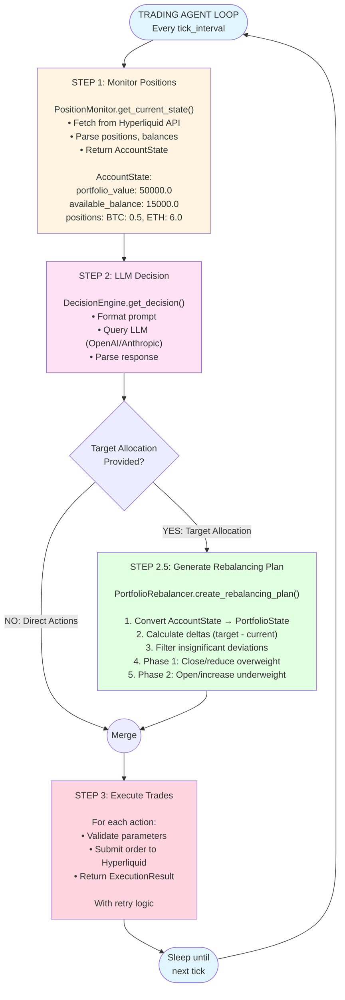
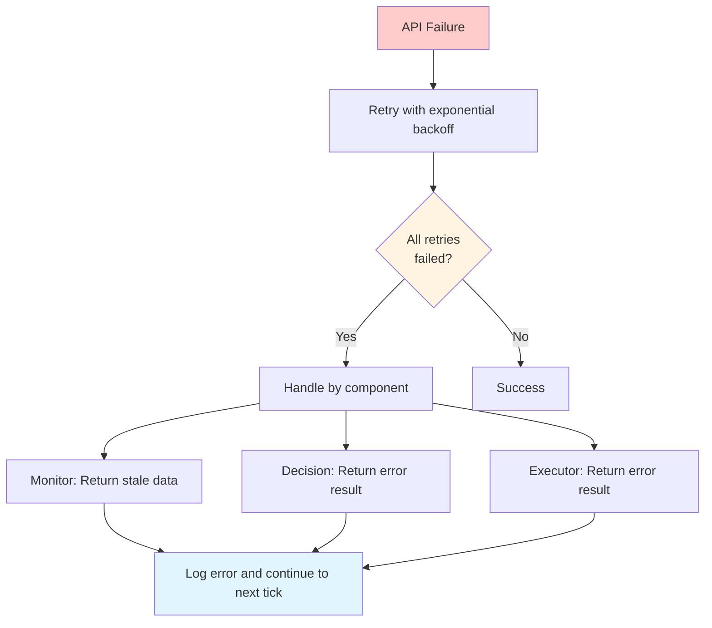
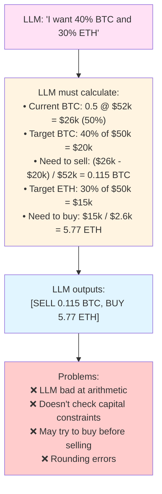
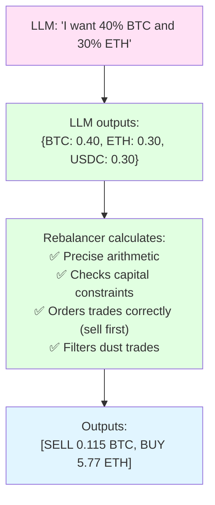

# Trading Agent Architecture - Portfolio Management

## System Flow



## Key Components

### 1. PositionMonitor
- **Purpose**: Fetch current portfolio state from Hyperliquid
- **Output**: `AccountState` with positions, balances, portfolio value
- **Caching**: Returns stale data if API fails

### 2. DecisionEngine
- **Purpose**: Query LLM for trading decisions
- **Input**: Current account state + available strategies
- **Output**: `DecisionResult` with actions OR target allocation
- **Providers**: OpenAI, Anthropic

### 3. PortfolioRebalancer (NEW!)
- **Purpose**: Convert target allocation → ordered trade sequence
- **Logic**: 
  - Calculate deltas
  - Filter small deviations
  - Order trades (close before open)
  - Respect capital constraints
- **Output**: `RebalancingPlan` with ordered actions

### 4. TradeExecutor
- **Purpose**: Submit orders to Hyperliquid exchange
- **Features**: 
  - Validation
  - Market/limit orders
  - Retry logic
  - Error handling

## Data Flow

```mermaid
flowchart TD
    A[AccountState<br/>raw positions] --> B[PortfolioState<br/>allocation percentages]
    B --> C[TargetAllocation<br/>desired percentages]
    C --> D[RebalancingPlan<br/>ordered trades]
    D --> E[TradeAction[]<br/>individual orders]
    E --> F[ExecutionResult[]<br/>order confirmations]
    
    style A fill:#e1f5ff
    style B fill:#fff4e1
    style C fill:#ffe1f5
    style D fill:#e1ffe1
    style E fill:#ffd4e1
    style F fill:#d4e1ff
```

## Decision Modes

### Mode 1: Target Allocation (Recommended)

**When to use:**
- Strategic rebalancing
- Multi-step position changes
- Capital constraints matter
- Allocation-based strategies

**Example strategies:**
- Balanced portfolio (40% BTC, 30% ETH, 30% cash)
- Risk-off (100% cash)
- Funding arbitrage (40% short perp, 40% long spot, 20% cash)

### Mode 2: Direct Actions (Legacy)

**When to use:**
- Time-sensitive tactical trades
- Specific order types (limit orders)
- Single-step actions
- Direct control needed

**Example strategies:**
- Breakout trading (buy BTC on signal)
- Stop-loss (close position immediately)
- Limit order placement

## Configuration

```python
# Agent initialization
agent = TradingAgent(config)

# Rebalancer settings
agent.rebalancer = PortfolioRebalancer(
    min_trade_value=10.0,        # Skip trades < $10
    max_slippage_pct=0.005,      # 0.5% max slippage
    rebalance_threshold=0.05,    # 5% deviation triggers action
)

# Tick interval
config.agent.tick_interval_seconds = 60  # Run every 60 seconds
```

## Error Handling



## Logging

All operations are logged with structured JSON:

```json
{
  "timestamp": "2025-10-22T10:30:00Z",
  "level": "INFO",
  "tick": 42,
  "portfolio_value": 50000.0,
  "num_actions": 2,
  "selected_strategy": "balanced-growth",
  "num_rebalance_actions": 2,
  "estimated_cost": 25.0
}
```

## Performance Characteristics

- **Latency tolerance**: Minutes (suitable for LLM decision-making)
- **Tick interval**: 60 seconds (configurable)
- **Portfolio size**: $500 - $5,000 (small startup scale)
- **Trades per tick**: 0-10 (typically 1-3)
- **Decision time**: 2-10 seconds (LLM query)
- **Execution time**: 1-5 seconds per trade

## Comparison: Before vs After

### Before (Direct Actions Only)



### After (Target Allocation)



## Summary

The new architecture separates concerns:
- **LLM**: Strategy and allocation decisions (what to do)
- **Code**: Execution planning and constraints (how to do it)

This results in:
- ✅ More reliable trade execution
- ✅ Better capital management
- ✅ Simpler LLM prompts
- ✅ Testable rebalancing logic
- ✅ Fewer execution errors
