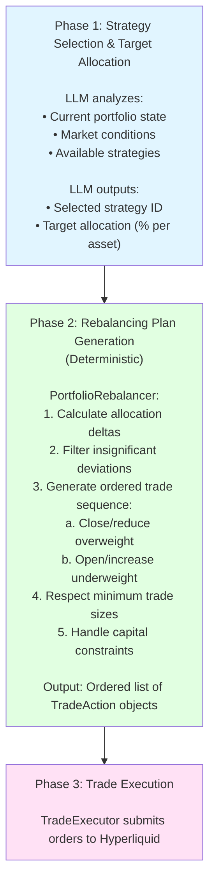

# Portfolio State Management & Rebalancing

## Overview

The trading agent now supports **target allocation-based portfolio management**, allowing the LLM to specify desired portfolio allocations rather than individual trades. The system automatically generates optimal rebalancing plans that respect capital constraints and execution order.

## Architecture

### Two-Phase Decision Flow



## Key Components

### 1. PortfolioState

Represents current portfolio with allocation percentages:

```python
@dataclass
class PortfolioState:
    total_value: float
    available_balance: float
    allocations: dict[str, float]  # coin -> percentage (0.0 to 1.0)
    positions: dict[str, Position]
    timestamp: float
```

**Example:**
```python
{
    "total_value": 50000.0,
    "available_balance": 15000.0,
    "allocations": {
        "BTC": 0.50,  # 50% in BTC
        "ETH": 0.20,  # 20% in ETH
        "USDC": 0.30  # 30% in cash
    }
}
```

### 2. TargetAllocation

Desired portfolio allocation:

```python
@dataclass
class TargetAllocation:
    allocations: dict[str, float]  # Must sum to ~1.0
    strategy_id: str | None
    reasoning: str
```

### 3. PortfolioRebalancer

Generates optimal rebalancing plans:

```python
class PortfolioRebalancer:
    def __init__(
        self,
        min_trade_value: float = 10.0,      # Avoid dust trades
        max_slippage_pct: float = 0.005,    # 0.5% max slippage
        rebalance_threshold: float = 0.05,  # 5% deviation triggers rebalance
    )
    
    def create_rebalancing_plan(
        self,
        current: PortfolioState,
        target: TargetAllocation,
    ) -> RebalancingPlan
```

**Rebalancing Logic:**

1. **Calculate Deltas**: `target_pct - current_pct` for each asset
2. **Filter Small Deviations**: Ignore changes < `rebalance_threshold`
3. **Phase 1 - Close Overweight**: Sell/close positions above target (generates capital)
4. **Phase 2 - Open Underweight**: Buy positions below target (uses capital)
5. **Respect Constraints**: Minimum trade sizes, available capital

### 4. RebalancingPlan

Ordered sequence of trades:

```python
@dataclass
class RebalancingPlan:
    actions: list[TradeAction]  # Ordered list
    estimated_cost: float       # Fees + slippage
    reasoning: str
```

## Usage Examples

### Example 1: Strategic Rebalancing

**Current Portfolio:**
- BTC: 80% ($41,600)
- USDC: 20% ($8,400)

**Target Allocation:**
- BTC: 40%
- ETH: 30%
- USDC: 30%

**Generated Plan:**
1. SELL 0.4 BTC (reduce from 80% to 40%)
2. BUY ETH with $15,000 (increase from 0% to 30%)

### Example 2: Risk-Off (Exit All Positions)

**Target Allocation:**
- USDC: 100%

**Generated Plan:**
1. CLOSE all BTC positions
2. CLOSE all ETH positions

### Example 3: No Rebalancing Needed

**Current:** BTC 40%, ETH 30%, USDC 30%
**Target:** BTC 42%, ETH 32%, USDC 26%

**Result:** No actions (deviations < 5% threshold)

## LLM Response Formats

The LLM can respond in two ways:

### Option 1: Target Allocation (Recommended)

```json
{
  "selected_strategy": "funding-harvest-lite",
  "target_allocation": {
    "BTC": 0.30,
    "ETH": 0.20,
    "USDC": 0.50
  }
}
```

**Use when:**
- Strategic portfolio rebalancing
- Implementing allocation-based strategies
- Multi-step position changes needed
- Capital constraints matter

### Option 2: Direct Actions (Legacy)

```json
{
  "selected_strategy": "compression-pop",
  "actions": [
    {
      "action_type": "buy",
      "coin": "BTC",
      "market_type": "perp",
      "size": 0.5,
      "price": null,
      "reasoning": "Breakout signal"
    }
  ]
}
```

**Use when:**
- Time-sensitive tactical trades
- Specific order types needed (limit orders)
- Single-step actions
- Direct control required

## Configuration

### Rebalancer Parameters

```python
# In agent.py initialization
self.rebalancer = PortfolioRebalancer(
    min_trade_value=10.0,        # Minimum $10 per trade
    max_slippage_pct=0.005,      # 0.5% max slippage
    rebalance_threshold=0.05,    # 5% deviation triggers action
)
```

**Tuning Guidelines:**

- **min_trade_value**: Set based on exchange fees (avoid unprofitable dust trades)
- **rebalance_threshold**: Higher = fewer trades, lower = more precise tracking
- **max_slippage_pct**: Protect against poor execution in illiquid markets

## Benefits

### 1. Separation of Concerns
- **LLM**: Strategy and allocation decisions (what to do)
- **Code**: Execution planning and constraints (how to do it)

### 2. Capital Constraint Handling
- Automatically orders trades to free capital before using it
- Prevents "insufficient balance" errors

### 3. Multi-Step Rebalancing
- Handles complex portfolio transitions
- Example: 100% BTC → 50% BTC / 50% ETH requires selling BTC first

### 4. Deterministic Execution
- Rebalancing logic is testable and predictable
- No LLM hallucination in trade sizing

### 5. Cost Awareness
- Filters out small trades below minimum threshold
- Estimates total rebalancing cost

## Testing

Run the example:

```bash
cd hyperliquid-trading-agent
uv run python examples/portfolio_rebalancing_example.py
```

This demonstrates:
- Large rebalancing (80% BTC → balanced portfolio)
- Small deviation (no action needed)
- Risk-off scenario (exit all positions)

## Integration with Strategies

Strategies can now specify target allocations:

**Example: Funding Harvest Strategy**

```markdown
## Target Allocation

When funding rate > threshold:
- Short perp: 40%
- Long spot hedge: 40%
- Cash buffer: 20%

When funding rate < threshold:
- Cash: 100% (exit positions)
```

**LLM Response:**
```json
{
  "selected_strategy": "funding-harvest-lite",
  "target_allocation": {
    "BTC-PERP-SHORT": 0.40,
    "BTC-SPOT-LONG": 0.40,
    "USDC": 0.20
  }
}
```

## Limitations & Future Work

### Current Limitations

1. **Price Data**: Cannot open new positions without current market prices
   - **Workaround**: LLM should only target assets with existing positions or provide prices
   - **Future**: Integrate market data fetching

2. **Position Direction**: No explicit long/short modeling
   - **Workaround**: Use separate coins for long/short (e.g., "BTC-LONG", "BTC-SHORT")
   - **Future**: Add position direction to PortfolioState

3. **Partial Fills**: Assumes orders fill completely
   - **Future**: Add order status tracking and retry logic

4. **Slippage Estimation**: Uses fixed percentage
   - **Future**: Dynamic slippage based on order book depth

### Potential Enhancements

1. **Multi-LLM Calls**: For complex strategies, use multiple LLM calls:
   - Call 1: Analyze market → select strategy
   - Call 2: Given strategy → determine target allocation
   - Call 3: Review plan → approve/adjust

2. **Gradual Rebalancing**: Spread large rebalances over multiple ticks
   - Reduce market impact
   - TWAP-style execution

3. **Risk Limits**: Add portfolio-level constraints
   - Max leverage
   - Max position concentration
   - Correlation limits

4. **Backtesting**: Simulate rebalancing plans against historical data

## Summary

The portfolio management system provides a clean separation between strategic decision-making (LLM) and tactical execution (code). This architecture:

- ✅ Handles capital constraints automatically
- ✅ Supports multi-step rebalancing
- ✅ Provides deterministic, testable execution
- ✅ Minimizes code changes to existing system
- ✅ Works with existing LLM latency tolerance
- ✅ Scales to small portfolio sizes ($500-$5000)

The LLM can now think in terms of "I want 40% BTC, 30% ETH" rather than "sell 0.3 BTC, buy 5 ETH", making strategies more intuitive and robust.
