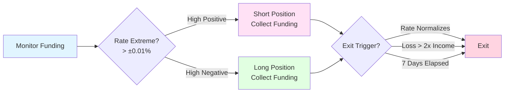

# Funding Harvest Lite

A low-risk strategy that captures funding rate arbitrage opportunities on Hyperliquid perpetual futures.

## Visual Overview



**Key Concept:** Earn funding payments by taking the opposite side when rates are extreme, exit when rates normalize.

## Strategy Logic

### Overview
Takes positions to collect funding payments when rates are extreme. Goes long when funding is very negative (shorts pay longs) and short when funding is very positive (longs pay shorts).

### Entry Conditions
- Funding rate exceeds threshold (e.g., ±0.01% per 8h)
- Open interest is stable or increasing
- Low recent volatility (reduces directional risk)
- Sufficient liquidity in order book

### Position Sizing
- Base size: 1-2% of portfolio
- Scale up with funding rate magnitude
- Reduce size if volatility increases
- Maximum 5% allocation per position

### Exit Conditions
- Funding rate normalizes (crosses back to ±0.005%)
- Unrealized loss exceeds 2x expected funding income
- Position held for 7+ days
- Volatility spike (ATR increases >50%)

## Risk Management

### Stop Loss
- Hard stop: -3% from entry
- Trailing stop: Lock in profits after +2%

### Hedging
- Can hedge with spot or other perps
- Delta-neutral when possible

### Correlation
- Avoid multiple funding trades on correlated assets
- Maximum 3 concurrent funding positions

## Performance Expectations

- **Win Rate**: 65-75%
- **Average Hold Time**: 2-4 days
- **Profit Factor**: 1.5-2.0
- **Max Drawdown**: 5-8%
- **Best Regimes**: Ranging, Funding Extreme

## Configuration

Adjust parameters in strategy metadata:

```markdown
---
regime: ["ranging", "funding_extreme"]
risk_level: low
max_allocation: 0.2
min_sharpe: 0.8
---
```

## Example Trade

**Setup**: BTC funding rate at +0.015% (very high)
- **Entry**: Short BTC at $45,000
- **Expected Funding**: Collect ~0.045% per day
- **Exit Target**: Funding normalizes to +0.005%
- **Stop Loss**: $46,350 (+3%)
- **Outcome**: Held 3 days, collected 0.135% funding, exited at $44,800 for total +0.58% profit

## Monitoring

Key metrics to track:
- Funding rate trends
- Open interest changes
- Realized funding income
- Directional P&L vs funding income
- Strategy Sharpe ratio
