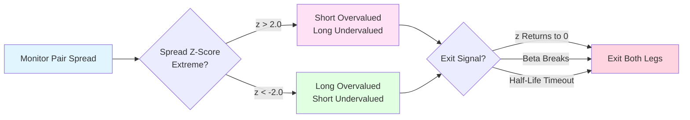

# Pairs Beta Sync

A relative-value strategy that trades spread dislocations between cointegrated asset pairs, maintaining beta-hedged positions for near-zero delta exposure.

## Visual Overview



**Key Concept:** Trade pairs with stable relationships – when spread widens, go long undervalued/short overvalued, exit when spread normalizes.

## Strategy Logic

### Overview
Identifies two assets with stable historical relationships (cointegration or consistent beta) and trades temporary spread dislocations. Goes long the undervalued leg and short the overvalued leg, sizing positions to achieve beta-neutral exposure. Exits when the spread mean-reverts.

### Entry Conditions
- Two assets show stable cointegration relationship (rolling 300-bar lookback)
- Spread residual z-score exceeds entry threshold (|z| > 2.0)
- Beta relationship stable (< 30% change in rolling beta)
- No protocol news or token listings affecting either leg
- Sufficient liquidity in both legs for synchronized execution
- Spread volatility within normal range (< 2x historical average)

**Spread Calculation:**
```
residual = asset_y - (beta * asset_x)
z_score = (residual - mean(residual)) / std(residual)
```

**Entry Logic:**
- **z > 2.0**: Short asset_y, long asset_x (beta-adjusted)
- **z < -2.0**: Long asset_y, short asset_x (beta-adjusted)

### Position Sizing
- Size by spread volatility: `position_size = risk / spread_vol`
- Beta-adjusted sizing to achieve near-zero delta
- Maximum 40% allocation per pair trade
- Maximum leverage: 2x
- Time stop at spread half-life

### Exit Conditions
- Spread z-score returns to neutral (|z| < 0.5)
- Time stop reached: Spread half-life elapsed without reversion
- Cointegration relationship breaks: Rolling beta changes > 30%
- Protocol news or token listing announced affecting one leg
- Spread volatility spike: Spread vol exceeds 2x historical average
- Leg synchronization fails: Unable to execute both legs within 5 minutes
- Stop loss: Spread moves 2x against position

## Risk Management

### Stop Loss
- Spread stop: Exit if spread moves 2x entry z-score against position
- Time stop: Exit at spread half-life if no reversion
- Relationship break: Exit if beta changes > 30%

### Take Profit
- Primary target: Spread z-score returns to neutral (|z| < 0.5)
- Partial exit: 50% at z = 1.0, 50% at z = 0.5

### Position Management
- Staggered maker entries for both legs
- Synchronize legs within seconds to minutes
- Rebalance if beta drifts during trade
- Scale out as spread converges

### Execution Strategy
- **Entry**: Staggered maker orders for both legs
- **Synchronization**: Execute both legs within 5 minutes
- **Exit**: Taker orders on target or invalidation

## Performance Expectations

- **Win Rate**: 60-70%
- **Average Hold Time**: 3-8 hours (minimum 120 minutes)
- **Profit Factor**: 1.8-2.4
- **Max Drawdown**: 10-15%
- **Expected Switching Cost**: 25 bps per trade (both legs)
- **Best Regimes**: Range-bound, Carry-friendly

## Configuration

Strategy parameters:

```toml
[strategy.pairs-beta-sync]
enabled = true
max_allocation = 0.40
max_leverage = 2.0
risk_per_trade = 0.02  # 2% risk

# Pair parameters
lookback_bars = 300
z_entry = 2.0
z_exit = 0.5
max_beta_change_pct = 0.30

# Risk parameters
max_spread_vol_multiple = 2.0
max_leg_sync_minutes = 5
stop_z_multiple = 2.0

# Pairs to monitor
pairs = [
    { asset_x = "ETH", asset_y = "BTC", min_correlation = 0.85 },
    { asset_x = "SOL", asset_y = "ETH", min_correlation = 0.80 },
    { asset_x = "AVAX", asset_y = "SOL", min_correlation = 0.75 }
]
```

## Technical Parameters

### Cointegration Analysis
- **Lookback Period**: 300 bars
- **Entry Z-Score**: ±2.0
- **Exit Z-Score**: ±0.5
- **Beta Stability**: < 30% change

### Spread Metrics
- **Half-Life**: Calculate from historical mean reversion
- **Spread Volatility**: Rolling standard deviation
- **Correlation**: Minimum 0.75-0.85 depending on pair

### Risk Metrics
- **Stop Loss**: 2x entry z-score
- **Time Stop**: Spread half-life
- **Synchronization**: 5 minutes max between legs

## Regime Compatibility

### Compatible Regimes
- **Range-bound**: Spread mean reversion more reliable
- **Carry-friendly**: Stable relationships

### Avoid Regimes
- **Event-risk**: Protocol news can break relationships

## Example Trade

**Setup**: ETH-BTC spread at extreme
- **Historical Beta**: 0.065 (ETH = 0.065 * BTC)
- **Current Prices**: ETH = $2,450, BTC = $43,500
- **Expected ETH**: 0.065 * $43,500 = $2,827.50
- **Residual**: $2,450 - $2,827.50 = -$377.50
- **Z-Score**: -2.3 (ETH undervalued vs BTC)
- **Entry**: Long ETH at $2,450, Short BTC at $43,500
- **Position Sizing**: 
  - Long 10 ETH ($24,500)
  - Short 0.65 BTC ($28,275) → Beta-adjusted for near-zero delta
- **Spread Half-Life**: 6 hours
- **Outcome**: Spread converged in 4 hours. ETH rallied to $2,520, BTC stayed at $43,500. Z-score returned to 0.4. Exited for +$700 profit on ETH leg, -$0 on BTC leg = +$700 total (+2.86% on capital)

## Monitoring

Key metrics to track:
- Spread z-score in real-time
- Rolling beta stability
- Correlation between assets
- Spread half-life
- Time in position
- Leg synchronization quality
- Protocol news for both assets
- Spread volatility

## Risk Warnings

- **Relationship Risk**: Cointegration can break permanently
- **Protocol Risk**: News affecting one leg can invalidate pair
- **Execution Risk**: Leg synchronization failures create directional exposure
- **Liquidity Risk**: Thin markets can prevent proper hedging
- **Correlation Risk**: Correlations can change during market stress
- **Complexity**: Requires understanding of statistical arbitrage
- **Slippage**: Two legs mean double the execution costs

## Backtest Outline

```python
# Pseudocode for backtesting
def calculate_spread(asset_x, asset_y, lookback=300):
    # Calculate rolling beta
    returns_x = asset_x.pct_change()
    returns_y = asset_y.pct_change()
    beta = covariance(returns_x, returns_y) / variance(returns_x)
    
    # Calculate residual
    residual = asset_y - (beta * asset_x)
    
    # Calculate z-score
    z_score = (residual - mean(residual[-lookback:])) / std(residual[-lookback:])
    
    return z_score, beta, residual

z_score, beta, residual = calculate_spread(asset_x, asset_y)
spread_vol = std(residual)
half_life = calculate_half_life(residual)

# Entry conditions
if abs(z_score) > z_entry and spread_vol < 2.0 * historical_avg:
    if not protocol_news():
        if z_score > z_entry:
            # Spread too high → Short Y, Long X
            short_y_size = calculate_size(spread_vol)
            long_x_size = short_y_size * beta  # Beta-adjusted
            
            enter_short(asset_y, short_y_size)
            enter_long(asset_x, long_x_size)
            set_time_stop(half_life)
            
        elif z_score < -z_entry:
            # Spread too low → Long Y, Short X
            long_y_size = calculate_size(spread_vol)
            short_x_size = long_y_size * beta  # Beta-adjusted
            
            enter_long(asset_y, long_y_size)
            enter_short(asset_x, short_x_size)
            set_time_stop(half_life)

# Exit management
current_z = calculate_spread(asset_x, asset_y)[0]
current_beta = calculate_spread(asset_x, asset_y)[1]

if abs(current_z) < z_exit:
    exit_both_legs()  # Spread converged
elif abs(current_z) > 2.0 * z_entry:
    exit_both_legs()  # Spread widening (stop loss)
elif abs(current_beta - beta) / beta > 0.30:
    exit_both_legs()  # Relationship breaking
elif time_stop_reached():
    exit_both_legs()
elif protocol_news():
    exit_both_legs()
```

## Why This Suits Small Capital + LLM Latency

- **Delta-light**: Near-zero directional exposure reduces risk
- **Few trades**: Only trades when clear spread dislocations occur
- **Latency tolerant**: Minutes-scale synchronization acceptable
- **Maker-friendly**: Can use limit orders for both legs
- **Clear signals**: Z-score thresholds are unambiguous
- **Low frequency**: Spread dislocations are infrequent
