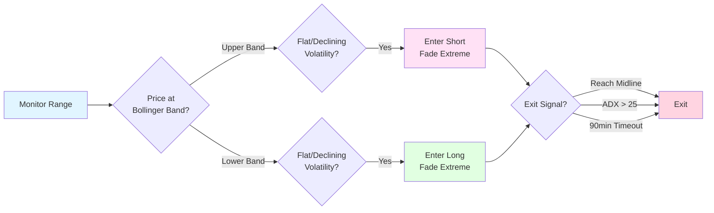

# Range Sip

A mean-reversion strategy that fades Bollinger Band extremes in well-defined ranging markets, targeting quick returns to the midline.

## Visual Overview



**Key Concept:** In ranging markets, fade extremes (Bollinger Band touches) back to the mean when volatility is declining.

## Strategy Logic

### Overview
Trades mean reversion in horizontal ranges by fading touches of the 2-sigma Bollinger Bands when volatility is declining and orderbook shows exhaustion. Uses small grid entries with tight stops to capture quick moves back to the range midpoint.

### Entry Conditions
- Well-defined horizontal range (flat Bollinger Band slope)
- Price tags 2-sigma Bollinger Band
- Declining volatility (Bollinger Band slope ≤ 0)
- Orderbook exhaustion signals (large imbalance at extremes)
- ADX < 25 (not trending)
- No breaking news or scheduled macro events
- No recent failed fades (avoid fighting acceleration)

**Entry Logic:**
- **Long**: Price at lower 2σ band with flat/declining volatility
- **Short**: Price at upper 2σ band with flat/declining volatility

### Position Sizing
- Small grid entries: 1-2% per level
- Maximum 30% allocation per position
- Maximum leverage: 3x
- Avoid chasing multiple fades in accelerating tape

### Exit Conditions
- Price reaches Bollinger Band midline (primary target)
- Price reaches 0.8x ATR profit from entry (secondary target)
- ADX rises above 25 (trend emergence)
- Bollinger Band slope turns positive (volatility expansion)
- Time stop reached: 90 minutes without mean reversion
- Breaking news or scheduled macro event
- Multiple failed fades: 3 consecutive stop-outs within 2 hours
- Stop loss: 1.2x ATR beyond extreme

## Risk Management

### Stop Loss
- Hard stop: 1.2x ATR beyond the band extreme
- Time stop: 30-90 minutes without mean reversion

### Take Profit
- Primary target: Bollinger Band midline
- Secondary target: 0.8x ATR from entry

### Position Management
- Small grid: 3-5 levels near band extreme
- Scale out: 50% at midline, 50% at 0.8 ATR
- Quick exit: If ADX rises or volatility expands

### Execution Strategy
- **Entry**: Post-only maker orders (grid near band)
- **Exit**: Taker orders on target or invalidation

## Performance Expectations

- **Win Rate**: 65-75%
- **Average Hold Time**: 30-60 minutes (minimum 45 minutes)
- **Profit Factor**: 1.6-2.0
- **Max Drawdown**: 8-12%
- **Expected Switching Cost**: 20 bps per trade
- **Best Regimes**: Range-bound

## Configuration

Strategy parameters:

```toml
[strategy.range-sip]
enabled = true
max_allocation = 0.30
max_leverage = 3.0
risk_per_trade = 0.015  # 1.5% risk

# Bollinger Band parameters
bb_length = 20
bb_deviation = 2.0
bb_slope_threshold = 0.0  # Flat or declining

# Range parameters
max_adx = 25
atr_period = 14

# Risk parameters
stop_atr_multiple = 1.2
target_atr_multiple = 0.8
time_stop_minutes = 90
max_failed_fades = 3
failed_fade_window_hours = 2
```

## Technical Parameters

### Bollinger Bands
- **Length**: 20 periods
- **Deviation**: 2.0 standard deviations
- **Slope**: ≤ 0 (flat or declining)

### Range Filters
- **ADX**: < 25 (not trending)
- **ATR Period**: 14 bars
- **Volatility**: Declining or stable

### Risk Metrics
- **Stop Loss**: 1.2x ATR beyond band extreme
- **Take Profit**: Midline or 0.8x ATR
- **Time Stop**: 30-90 minutes

## Regime Compatibility

### Compatible Regimes
- **Range-bound**: Ideal for mean reversion

### Avoid Regimes
- **Trending**: Bands can walk in one direction
- **Event-risk**: News can break ranges violently

## Example Trade

**Setup**: BTC in tight range
- **Range**: $42,000 - $44,000 (well-defined horizontal)
- **Bollinger Bands**: 20-period, 2σ at $42,100 (lower) and $43,900 (upper)
- **BB Slope**: -0.02 (declining volatility)
- **ADX**: 18 (not trending)
- **Price**: Tags lower band at $42,120
- **Orderbook**: Large bids exhausted, asks building
- **Entry**: Long at $42,150 (small grid: $42,120, $42,150, $42,180)
- **ATR**: $400
- **Stop Loss**: $41,670 (1.2x ATR = $480 below entry)
- **Target**: $43,000 (midline) or $42,470 (0.8x ATR = $320)
- **Outcome**: Price reverted to midline in 35 minutes, exited at $42,980 for +$830 profit (+1.97%)

## Monitoring

Key metrics to track:
- Bollinger Band width and slope
- ADX levels (trend strength)
- Orderbook imbalances at extremes
- Time in position
- Failed fade count
- Volatility regime changes
- Range integrity (support/resistance holding)

## Risk Warnings

- **Trend Risk**: Ranges can break into trends, causing losses
- **Acceleration Risk**: Multiple failed fades indicate trend emergence
- **Event Risk**: News can violently break ranges
- **Overtrading**: Too many fades can accumulate losses
- **Liquidity Risk**: Thin orderbooks at extremes can cause slippage
- **Correlation**: Multiple range trades can correlate during market-wide breakouts

## Backtest Outline

```python
# Pseudocode for backtesting
bb_upper, bb_mid, bb_lower = calculate_bollinger_bands(length=20, dev=2.0)
bb_slope = calculate_slope(bb_upper, bb_lower)
adx = calculate_adx(period=14)

if price <= bb_lower and bb_slope <= 0 and adx < 25 and orderbook_exhaustion():
    if failed_fades < 3:
        place_maker_grid_long(levels=[bb_lower, bb_lower + 0.1%, bb_lower + 0.2%])
        set_stop_loss(bb_lower - 1.2 * atr)
        set_target(bb_mid or entry + 0.8 * atr)
        set_time_stop(90_minutes)

elif price >= bb_upper and bb_slope <= 0 and adx < 25 and orderbook_exhaustion():
    if failed_fades < 3:
        place_maker_grid_short(levels=[bb_upper, bb_upper - 0.1%, bb_upper - 0.2%])
        set_stop_loss(bb_upper + 1.2 * atr)
        set_target(bb_mid or entry - 0.8 * atr)
        set_time_stop(90_minutes)

# Exit management
if price_reaches_target():
    exit_position()
elif adx > 25:
    exit_position()  # Trend emerging
elif bb_slope > 0:
    exit_position()  # Volatility expanding
elif time_stop_reached():
    exit_position()
elif stop_loss_hit():
    exit_position()
    increment_failed_fades()
```

## Why This Suits Small Capital + LLM Latency

- **Maker-led approach**: Post-only orders reduce costs
- **Decisions at bar closes**: Not microsecond-sensitive
- **Low frequency**: Only trades at band extremes
- **Clear signals**: Band touches are unambiguous
- **Time-boxed**: Quick exits prevent capital lock
- **Grid entries**: Can place multiple orders and wait for fills
