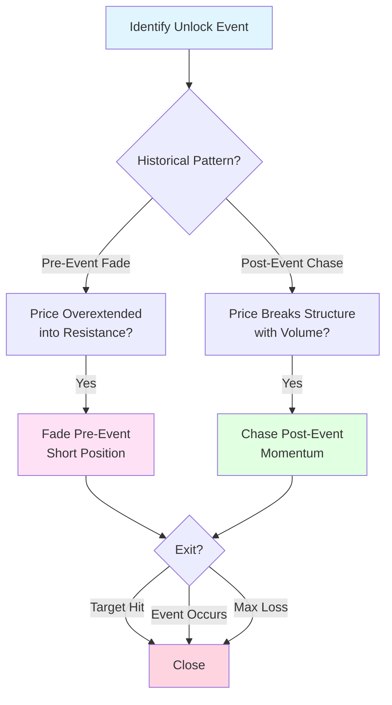

# Unlock Watch

An event-driven strategy that trades scheduled token unlock events by exploiting predictable pre-event drift and post-event momentum patterns.

## Visual Overview



**Key Concept:** Trade predictable patterns around token unlock events – fade overextension pre-event or chase momentum post-event.

## Strategy Logic

### Overview
Monitors scheduled token unlock events and trades based on historical reaction patterns. Can fade pre-unlock drift when price is overextended into resistance, or chase post-unlock momentum if price breaks structure with volume. Uses playbook-driven approach based on historical unlock behavior.

### Entry Conditions
- Scheduled token unlock event identified (from calendar)
- Historical pattern analysis shows consistent reaction
- Sufficient liquidity (bid-ask spread < 100 bps around event)
- Position sizing respects max loss per event threshold

**Pre-Event Fade Setup:**
- Price overextended into HTF resistance (1.0-1.5 ATR above support)
- Volume declining into event (distribution pattern)
- Sentiment overly bullish (contrarian signal)

**Post-Event Momentum Setup:**
- Price breaks structure with volume surge (> 80th percentile)
- Surprise element: Unlock smaller than expected or absorbed quickly
- Clear direction established within 2 hours of event

### Position Sizing
- Conservative: 1-2% of portfolio per event
- Maximum 20% allocation per position
- Maximum leverage: 2x
- Hard max loss per event: 3-5% of position

### Exit Conditions
- Pre-event fade: Target hit or event occurs
- Post-event momentum: Tight trailing stop hit
- Liquidity collapses: Bid-ask spread exceeds 100 bps
- Max loss per event reached
- Event outcome differs from historical pattern (no reaction within 2 hours)
- Surprise announcement: Unexpected protocol change or delay

## Risk Management

### Stop Loss
- Pre-event fade: 1.5-2.0 ATR from entry
- Post-event momentum: Tight trailing stop (0.5-1.0 ATR)
- Max loss per event: 3-5% of position size

### Take Profit
- Pre-event fade: Support level or 1.0-1.5 ATR
- Post-event momentum: Trail with tight stop, no fixed target

### Position Management
- Pre-place stop entries for post-event momentum
- Cancel orders if no trigger within 2 hours
- Scale out 50% at 1R, trail remaining 50%
- Quick exit if liquidity deteriorates

### Execution Strategy
- **Pre-event**: Limit orders at resistance levels
- **Post-event**: Stop entries or market orders on breakout
- **Exit**: Taker orders on stops or targets

## Performance Expectations

- **Win Rate**: 50-60%
- **Average Hold Time**: 3-12 hours (minimum 180 minutes)
- **Profit Factor**: 1.6-2.2
- **Max Drawdown**: 12-18%
- **Expected Switching Cost**: 30 bps per trade
- **Best Regimes**: Event-risk (designed for this regime)

## Configuration

Strategy parameters:

```toml
[strategy.unlock-watch]
enabled = true
max_allocation = 0.20
max_leverage = 2.0
risk_per_trade = 0.015  # 1.5% risk
max_loss_per_event = 0.04  # 4% max loss

# Pre-event fade parameters
pre_drift_atr_threshold = 1.2  # 1.2 ATR overextension
fade_stop_atr = 1.5

# Post-event momentum parameters
surprise_volume_percentile = 80
momentum_trail_atr = 0.75
max_wait_hours = 2

# Liquidity filters
max_spread_bps = 100
min_daily_volume = 1000000  # $1M minimum

# Event calendar
unlock_events = [
    { token = "TOKEN1", date = "2024-02-15", amount = "10M", historical_pattern = "fade" },
    { token = "TOKEN2", date = "2024-02-20", amount = "5M", historical_pattern = "momentum" }
]
```

## Technical Parameters

### Pre-Event Analysis
- **Overextension**: 1.0-1.5 ATR above support
- **Volume**: Declining into event
- **Resistance**: HTF levels identified

### Post-Event Analysis
- **Volume Surge**: > 80th percentile
- **Structure Break**: Clear breakout with follow-through
- **Reaction Time**: Within 2 hours of unlock

### Risk Metrics
- **Pre-Event Stop**: 1.5-2.0 ATR
- **Post-Event Trail**: 0.5-1.0 ATR
- **Max Loss**: 3-5% per event
- **Risk/Reward**: Minimum 1.5:1

## Regime Compatibility

### Compatible Regimes
- **Event-risk**: Designed specifically for scheduled events

### Avoid Regimes
- None (strategy is event-specific, not regime-dependent)

## Example Trade

**Setup**: TOKEN unlock scheduled, pre-event fade opportunity
- **Unlock Date**: February 15, 2024, 12:00 UTC
- **Unlock Amount**: 10M tokens (5% of supply)
- **Historical Pattern**: Price typically dips 3-5% into unlock, recovers after
- **Current Price**: $12.50 (at resistance, +$1.80 from support = 1.5 ATR)
- **Volume**: Declining over last 3 days
- **Entry**: Short at $12.45 (2 hours before unlock)
- **ATR**: $1.20
- **Stop Loss**: $14.25 (1.5 ATR = $1.80)
- **Target**: $10.80 (support level)
- **Outcome**: Price dipped to $11.20 at unlock time, recovered to $11.80 by end of day. Exited at $11.50 for +$0.95 profit (+7.6%)

## Monitoring

Key metrics to track:
- Unlock calendar and event timing
- Historical unlock patterns per token
- Pre-event price action and volume
- Post-event reaction speed and magnitude
- Liquidity conditions around events
- Surprise factors (delays, changes)
- Win rate by event type

## Risk Warnings

- **Event Risk**: Unlocks can be delayed or changed unexpectedly
- **Liquidity Risk**: Thin markets around events can cause slippage
- **Pattern Risk**: Historical patterns may not repeat
- **Surprise Risk**: Unexpected protocol changes can invalidate thesis
- **Execution Risk**: Fast-moving markets can gap through stops
- **Concentration**: Limited to tokens with scheduled unlocks
- **Complexity**: Requires event calendar maintenance and pattern analysis

## Backtest Outline

```python
# Pseudocode for backtesting
unlock_calendar = load_unlock_events()

for event in unlock_calendar:
    token = event.token
    unlock_time = event.datetime
    historical_pattern = analyze_historical_unlocks(token)
    
    # Pre-event fade setup
    pre_event_time = unlock_time - timedelta(hours=2)
    if current_time == pre_event_time:
        price = get_price(token)
        atr = calculate_atr(token)
        support = identify_support(token)
        
        if price > support + 1.2 * atr and volume_declining():
            # Overextended into resistance → Fade
            enter_short(token)
            set_stop_loss(price + 1.5 * atr)
            set_target(support)
            set_time_stop(unlock_time + timedelta(hours=4))
    
    # Post-event momentum setup
    post_event_time = unlock_time + timedelta(minutes=30)
    if current_time >= post_event_time and current_time <= unlock_time + timedelta(hours=2):
        if price_breaks_structure() and volume > 80th_percentile:
            # Surprise momentum → Chase with tight stop
            if breakout_direction == "up":
                enter_long(token)
                set_trailing_stop(0.75 * atr)
            else:
                enter_short(token)
                set_trailing_stop(0.75 * atr)
    
    # Exit management
    if liquidity_collapses():
        exit_position()
    elif max_loss_reached():
        exit_position()
    elif no_reaction_within_2_hours():
        exit_position()
    elif surprise_announcement():
        exit_position()
```

## Why This Suits Small Capital + LLM Latency

- **Few events**: Only trades scheduled unlocks (low frequency)
- **Playbook-driven**: Clear rules based on historical patterns
- **No microsecond reactions**: Events unfold over hours
- **Pre-planned**: Can set up positions in advance
- **Clear invalidation**: Easy to identify when thesis is wrong
- **Tolerates latency**: Minutes-scale response time acceptable
